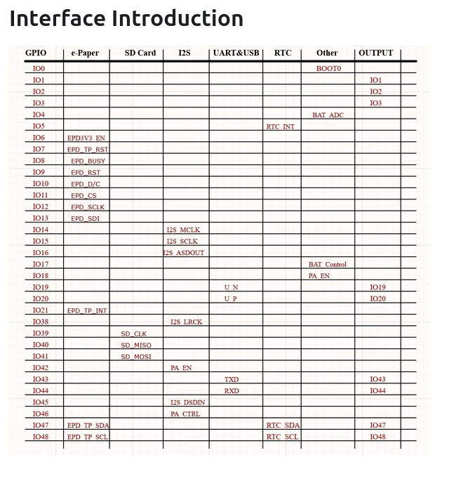

## Product Description

The [Waveshare ESP32-S3-ePaper-1.54](https://docs.waveshare.com/ESP32-S3-ePaper-1.54) is a low-power
AIoT development board built around the ESP32-S3. It includes a 1.54-inch e-paper display (200×200,
monochrome), PCF85063 RTC, SHTC3 temperature and humidity sensor, ES8311 audio codec with microphone and
speaker, microSD slot, and optional lithium battery charging circuitry.

This page covers the **non-touch** variants:

| SKU   | Product                    | Battery |
| ----- | -------------------------- | ------- |
| 32298 | ESP32-S3-ePaper-1.54       | Yes     |
| 32299 | ESP32-S3-ePaper-1.54-EN    | No      |

Touch variants (SKU 34211 / 34212) use a separate device page.

### Hardware Revisions

Waveshare ships two PCB revisions. Check the silkscreen on the back of the board:

- **V1:** ESP32-S3FH4R2 — 4 MB flash, 2 MB PSRAM (quad)
- **V2:** ESP32-S3-PICO-1-N8R8 — 8 MB flash, 8 MB PSRAM (octal)

The example configuration below targets **V2**. For V1 boards, change `flash_size` to `4MB` and set
`psram` to quad mode at 40 MHz.

## Product Images



## GPIO Pinout

| GPIO   | Function                          |
| ------ | --------------------------------- |
| GPIO0  | BOOT button (active low)          |
| GPIO4  | Battery ADC (2× voltage divider)  |
| GPIO5  | RTC interrupt                     |
| GPIO6  | E-paper power enable (EPD3V3 EN)  |
| GPIO8  | E-paper BUSY                      |
| GPIO9  | E-paper RESET                     |
| GPIO10 | E-paper DC                        |
| GPIO11 | E-paper CS                        |
| GPIO12 | E-paper SPI clock                 |
| GPIO13 | E-paper SPI MOSI                  |
| GPIO14 | I2S MCLK                          |
| GPIO15 | I2S SCLK                          |
| GPIO16 | I2S speaker data out              |
| GPIO17 | Battery power latch (BAT Control) |
| GPIO18 | PWR button (active low)           |
| GPIO38 | I2S LRCLK                         |
| GPIO39 | SD card clock                     |
| GPIO40 | SD card MISO                      |
| GPIO41 | SD card MOSI                      |
| GPIO42 | Audio PA enable                   |
| GPIO43 | UART TX (expansion header)        |
| GPIO44 | UART RX (expansion header)        |
| GPIO45 | I2S microphone data in            |
| GPIO46 | Audio amplifier control           |
| GPIO47 | I2C SDA (RTC, SHTC3, ES8311)      |
| GPIO48 | I2C SCL (RTC, SHTC3, ES8311)      |

## Flashing

Connect the board over USB-C. To enter download mode, hold **BOOT**, press **PWR**, then release
**BOOT**. Flash as a standard ESP32-S3 device.

When running on battery power, **GPIO17 must be driven HIGH at boot** or the onboard protection
circuit powers the board off. The base configuration handles this automatically.

## Basic Configuration

The base configuration below covers all on-board hardware: the 1.54-inch e-paper display, PCF85063
RTC, SHTC3 sensor, ES8311 audio path, battery voltage monitoring, and user buttons. Add your own
`wifi:`, `api:`, and `ota:` sections (or include them via packages) before flashing.

```yaml file=config.yaml
```

## Battery Percentage

A template sensor that derives a 0–100% reading from the onboard battery voltage. Adjust the
min/max voltages to match your specific cell.

```yaml file=battery-percentage.yaml
```

## Notes

- The e-paper display uses the built-in [`waveshare_epaper`](https://esphome.io/components/display/waveshare_epaper/) platform with model `1.54inv2`.
- PSRAM is recommended for display rendering; V2 boards have 8 MB octal PSRAM.
- The microSD slot (GPIO39–41) and deep-sleep power management are not included in the base config but can be added for battery-powered projects.
- For a community battery-dashboard example, see [almeiduh/esp32-s3-e-Paper-ha-monitor](https://github.com/almeiduh/esp32-s3-e-Paper-ha-monitor).
