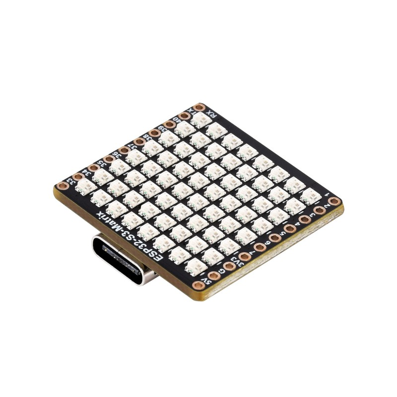
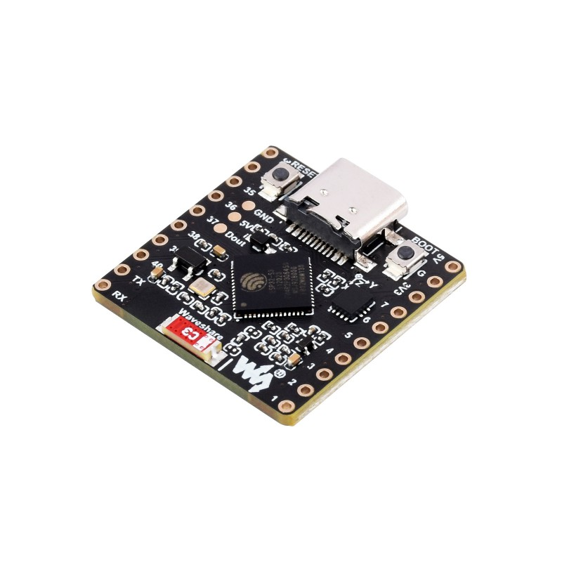

A module composed of:

- ESP32 S3 chip
- QMI8658C accelerometer and gyroscope
- 8 x 8 LED matrix

Powered by USB-C

Vendor documentation:

- [Product page](https://www.waveshare.com/esp32-s3-matrix.htm)
- [Wiki](https://www.waveshare.com/wiki/ESP32-S3-Matrix)

## GPIO Pinout

| PIN           | ESP32 | Description                                                             |
|---------------|-------|-------------------------------------------------------------------------|
| VCC           | VCC   | Power input (3.3V)                                                      |
| GND           | GND   | GND                                                                     |
| QMI SDA       | 11    | QMI8658 I2C SDA pin                                                     |
| QMI SCL       | 12    | QMI8658 I2C SCL pin                                                     |
| QMI IRQ1      | 10    | QMI8658 iterrupt 1 (does not work as well as IRQ2)                      |
| QMI IRQ2      | 13    | QMI8658 iterrupt 2                                                      |
| WS2811 LED    | 14    | Controlling the 8x8 LED matrix via neopixel                             |

## Product Images




## Device Specific Config

```yaml
esphome:
  name: "led8x8-qmi8658"
  friendly_name: "8x8 pixel matrix"
  comment: "ESP32-S3 with 8x8 LED Pixel matrix and QMI8658 accelerometer"

  platformio_options:
    board_build.flash_mode: dio

  libraries:
    - "Wire"
    - "SPI"
    - "SensorLib"

esp32:
  board: esp32-s3-devkitc-1
  framework:
    type: arduino

external_components:
- source: https://github.com/dala318/esphome-qmi8658

wifi:
  ssid: !secret wifi_ssid
  password: !secret wifi_password

captive_portal:

logger:
  level: DEBUG
  baud_rate: 0 # disable logging over uart

api:
  encryption:
    key: !secret api_key

ota:
  platform: esphome

web_server:

i2c:
  sda: GPIO11
  scl: GPIO12

sensor:
  - platform: qmi8658
    address: 0x6B
    interrupt_pin_1: GPIO10
    acceleration_x:
      name: "QMI8658 Acceleration X"
    acceleration_y:
      name: "QMI8658 Acceleration Y"
    acceleration_z:
      name: "QMI8658 Acceleration Z"
    gyroscope_x:
      name: "QMI8658 Gyro X"
    gyroscope_y:
      name: "QMI8658 Gyro Y"
    gyroscope_z:
      name: "QMI8658 Gyro Z"
    temperature:
      name: "QMI8658 Temperature"
      filters:
        - offset: 34.0
    update_interval: 5s

light:
    name: "NeoPixel Light"
    id: pixel_matrix
    type: RGB
    variant: WS2811
    pin: GPIO14
    num_leds: 64
    color_correct: [40%, 40%, 40%]
    effects: 
      - addressable_scan:
      - addressable_twinkle:

display:
  - platform: addressable_light
    id: pixel_display
    addressable_light_id: pixel_matrix
    width: 8
    height: 8
    pixel_mapper: |-
      if (x % 2 == 0) {
        return (x * 8) + y;
      }
      return (x * 8) + (7 - y);
    rotation: 180°
    update_interval: 1000ms
    auto_clear_enabled: true
    lambda: |-
          Color red = Color(0x5F0000);
          Color green = Color(0x005F00);
          Color blue = Color(0x00005F);
          it.rectangle(0, 0, 8, 8, red);
          it.rectangle(1, 1, 6, 6, green);
          it.rectangle(2, 2, 4, 4, blue);
          it.rectangle(3, 3, 2, 2, red);
```
