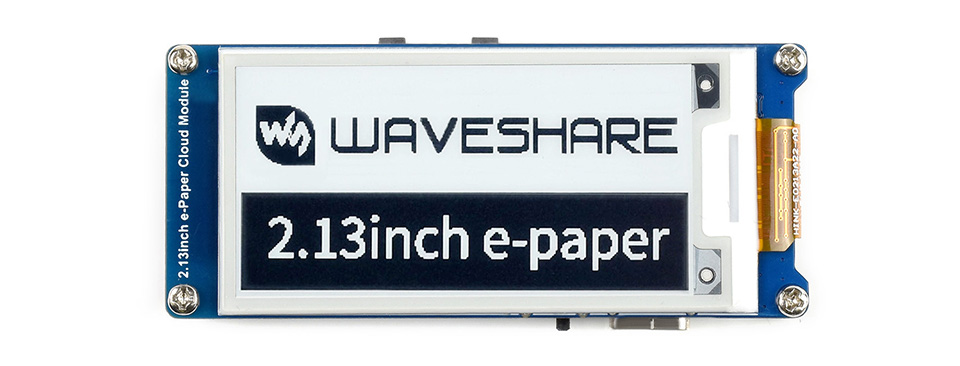
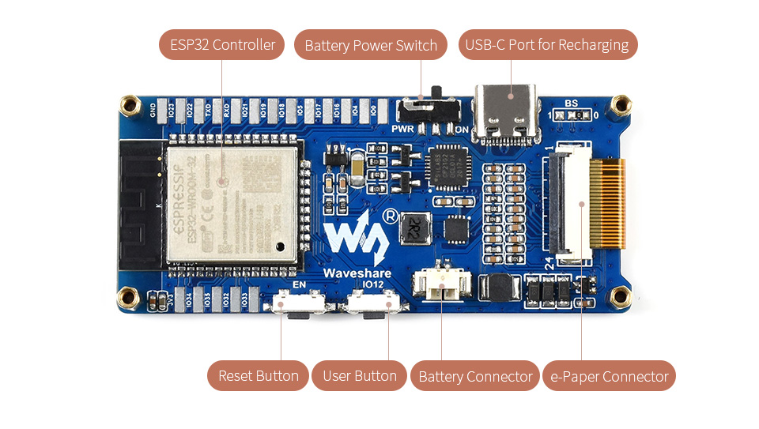

A module composed of:

- ESP32 chip
- E-Paper display of several different sizes
- Battery

Powered by USB-C

Vendor documentation:

- [Product page](https://www.waveshare.com/2.13inch-e-paper-cloud-module.htm)
- [Technical wiki](https://www.waveshare.com/wiki/2.13inch_e-Paper_Cloud_Module)

## GPIO Pinout

| PIN (e-Paper) | ESP32 | Description                                                             |
|---------------|-------|-------------------------------------------------------------------------|
| VCC           | VCC   | Power input (3.3V)                                                      |
| GND           | GND   | GND                                                                     |
| KEY           | 12    | User button, Low active                                                 |
| SCK           | 13    | CLK pin of SPI, clock input                                             |
| DIN           | 14    | MOSI pin of SPI, data input                                             |
| CS            | 15    | Chip select pin of SPI, Low active                                      |
| BUSY          | 25    | Busy pin, it indicates whether the e-Paper is busy                      |
| RST           | 26    | Reset pin, Low active                                                   |
| DC            | 27    | Data/Command control pin, Low for Command and High for Data             |
| ADC           | 36    | ADC data input, the voltage detected is the 1/3 of the battery voltage. |

## Product Images




## Flashing

Make sure you have a working driver installed for the CP2102 USB to serial convertor chip. I had problems with the stock MacOS Monterey one.
After that simply connect to the USB-C port and flash as usual (in case of problems with enter programming mode, connect IO0 to GND,
reset the device with reset button (EN) and keep the connection between GPIO0 and GND until programming starts).

## Device Specific Config

```yaml
substitutions:
  devicename: "waveshare"

esp32:
  board: esp32dev
  framework:
    type: arduino

sensor:
  - platform: adc
    pin: GPIO36
    name: "${devicename} Battery voltage"
    id: battery_voltage
    icon: mdi:battery
    device_class: voltage
    attenuation: auto # without attenuation the adc is saturated (VBat/3 > 1.1 V)
    filters:
     - multiply: 3
    update_interval: 60s

spi:
  clk_pin: GPIO13
  mosi_pin: GPIO14

binary_sensor:
  - platform: gpio
    pin:
      number: GPIO12
      inverted: true # user button pull IO12 to GND
      mode:          # pin as input and enable pull up
        input: true
        pullup: true
    name: "${devicename} button"
    filters:
      - delayed_on: 50ms
    on_press:
      - logger.log: "Button pressed"

font:
  - file: "gfonts://Roboto"
    id: roboto
    size: 20

display:
  - platform: waveshare_epaper
    cs_pin: GPIO15
    dc_pin: GPIO27
    busy_pin: GPIO25
    reset_pin: GPIO26
    model: 2.13in-ttgo-dke # choose your display size here
    rotation: 270
    full_update_every: 12 # every 12th time
    update_interval: 60s
    lambda: |-
      it.print(0, 0, id(roboto), "Hello World!");
```
