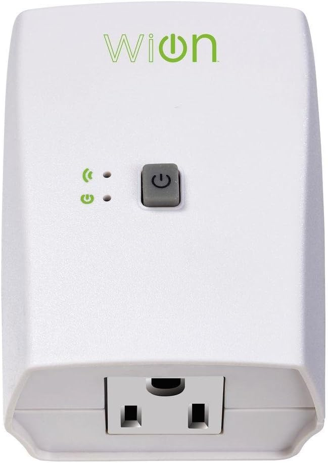

[Amazon Link](https://amzn.to/447q55e)

## WiOn 50050 Indoor WiFi Plug

The device has 2 indicator LEDs, 1 power button, 1 reset button and 1 controllable relay.
The device is controlled by a ESP8266 that is from ECO-PLUGS/PAGECO-PLUGS, and the [FCC filing](https://fcc.report/FCC-ID/PAGECO-PLUGS) can be found here.
The device uses a Proprietary app that cannot be flashed to ESPHome OTA, the initial install must be USB to Serial. Once ESPHome is installed all future downloads can be OTA.

## Product Image



## GPIO Pinout

The GPIO pinout was learned from [NorthernMan54](https://gist.github.com/NorthernMan54/ef912a07482b9ab83fa80b91b5b763e8).

The GPIOs being used are:

* Button: GPIO13
* Relay1: GPIO15
  
## Basic Configuration

```yaml
esphome:
  name: ecoplug
  friendly_name: EcoPlug

esp8266:
  board: esp01_1m

# Enable logging
logger:

# Enable Home Assistant API
api:
  encryption:
    key: !secret

ota:
  password: !secret

wifi:
  ssid: !secret wifi_ssid
  password: !secret wifi_password

  # Enable fallback hotspot (captive portal) in case wifi connection fails
  ap:
    ssid: "$proper_devicename Hotspot"
    password: !secret ap_password

binary_sensor:
  - platform: gpio
    pin:
      number: GPIO13
    id: button
    on_press:
     - switch.toggle: relay1

  - platform: status
    name: Eco Plug

switch:
  - platform: gpio
    name: "Eco Plug 1"
    pin: GPIO15
    id: relay1
    icon: "mdi:power-socket-us"

captive_portal:
```
