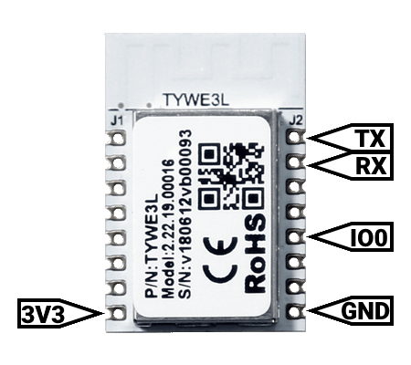

Wipro Next Smart Wi-Fi 20W CCT+RGB LED Batten | 16 Million Colours | White Tunable | Dimmable

[Amazon Link](https://amzn.eu/d/aR7MunR)

## Preparing the device for flashing

Remove the caps from both ends of the batten, desolder wires from one end of the led strip (Note the wire colors and pads) and carefully pullout the led strip along with the module from the other end. Swap Tx, Rx and use 3.3v logic for programming.



## Esp Code

```yaml
esphome:
  name: led-batten
  friendly_name: Led-Batten
  
esp8266:
  board: esp01_1m
  #restore_from_flash: true

#preferences:
  #flash_write_interval: 2min

# Enable logging
logger:

# Enable Home Assistant API
api:
  encryption:
    key: ""

ota:
  password: ""


wifi:
  ssid: ""
  password: ""
  fast_connect: True
  power_save_mode: none


sensor:

output:
  - platform: esp8266_pwm
    id: red
    pin: GPIO4
    inverted: False
  - platform: esp8266_pwm
    id: green
    pin: GPIO12
    inverted: False
  - platform: esp8266_pwm
    id: blue
    pin: GPIO14
    inverted: False
  - platform: esp8266_pwm
    id: cold_white
    pin: GPIO5
    inverted: False
  - platform: esp8266_pwm
    id: warm_white
    pin: GPIO13
    inverted: False

light:
  - platform: rgbww
    name: Wipro RGB
    default_transition_length: 0s
    red: red
    green: green
    blue: blue
    cold_white: cold_white
    warm_white: warm_white
    cold_white_color_temperature: 6500 K
    warm_white_color_temperature: 2700 K
    id: thelight
    color_interlock: true #Prevent white leds being on at the same time as RGB leds
    restore_mode: ALWAYS_ON #Start with light on after reboot/power-loss event, so that it works from a dumb lightswitch
    effects:
      - random:
      - strobe:
      - flicker:
          alpha: 50% #The percentage that the last color value should affect the light. More or less the “forget-factor” of an exponential moving average. Defaults to 95%.
          intensity: 50% #The intensity of the flickering, basically the maximum amplitude of the random offsets. Defaults to 1.5%.
      - lambda:
          name: Throb
          update_interval: 1s
          lambda: |-
            static int state = 0;
            auto call = id(thelight).turn_on();
            // Transtion of 1000ms = 1s
            call.set_transition_length(1000);
            if (state == 0) {
              call.set_brightness(1.0);
            } else {
              call.set_brightness(0.01);
            }
            call.perform();
            state += 1;
            if (state == 2)
              state = 0;
```

## Post Flashing

Repeat the steps used for preparing the device in reverse, solder the led strip back with it respective wires. Now when the device is connected to mains it gets connected to the network. (The TYWE3L Module wont power on when using ttl adaptor's 3.3v power, so assembling it back is neccessary for testing)
