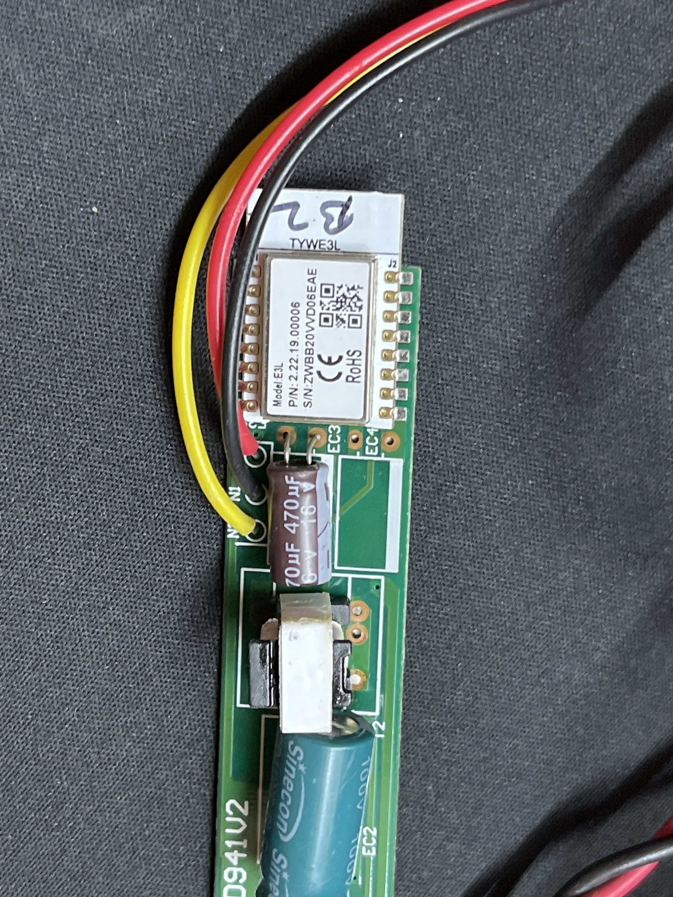

T5 Sized Tubelight with CCT & Dimming supports, limits being 2700K-6500K. Works natively with either Tuya/Smart Life/Wipro Smart Home. Based on TYWE3L.

## Flashing process

Open the two grey tabs on the sides of the batten and carefully pull out the PCB and solder the wires according to the TYWE3L pinout.Serial flashing is identical to that of ESP-12. Make sure to use 3.3V logic levels for serial communication (USB adapters like CH340G, CP2102). Using ESPHome Flasher is advisable.

## GPIO Pinout

| Pin    | Function            |
| ------ | ------------------- |
| GPIO05 | Brightness PWM pin  |
| GPIO13 | Colour Temp PWM pin |



## Configuration

```yaml
esphome:
  name: "wipro-next-cct-batten"

esp8266:
  board: esp01_1m

# Enable logging
logger:

# Enable Home Assistant API
api:
  encryption:
    key: !secret encryption_key

ota:
  password: !secret ota_password

wifi:
  ssid: !secret wifi_ssid
  password: !secret wifi_password

  # Enable fallback hotspot (captive portal) in case wifi connection fails
  ap:
    ssid: !secret fallback_ssid
    password: !secret fallback_password

captive_portal:

output:
  - platform: esp8266_pwm
    id: brightness_pwm
    pin: GPIO5
  - platform: esp8266_pwm
    id: color_temp_pwm
    pin: GPIO13
    inverted: true

light:
  - platform: color_temperature
    name: "wipro-next-cct-batten"
    color_temperature: color_temp_pwm
    brightness: brightness_pwm
    cold_white_color_temperature: 6500 K
    warm_white_color_temperature: 2700 K
```
