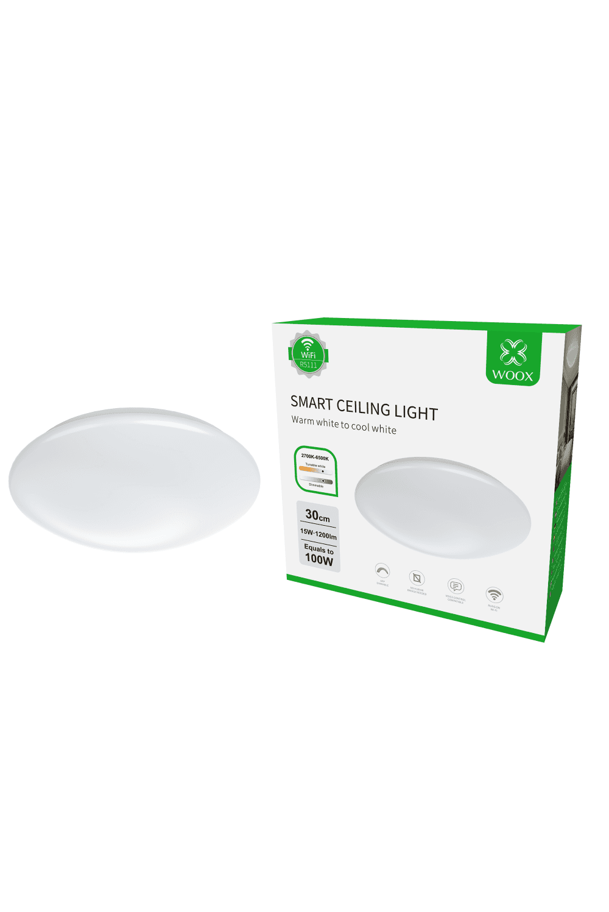

## Notes



Initial flashing instructions can be found here: <https://www.elektroda.com/rtvforum/topic4027381.html>

## GPIO Pinout

| Pin  | Function          |
| ---- | ----------------- |
| P0   | IR Receiver       |
| P6   | PWM WW            |
| P8   | PWM CW            |

## Board Configuration

```yaml

output:
  - platform: libretiny_pwm
    id: output_cw
    pin: P8
  - platform: libretiny_pwm
    id: output_ww
    pin: P6

light:
  - platform: cwww
    name: ${friendly_name}
    cold_white: output_cw
    warm_white: output_ww
    cold_white_color_temperature: 6500 K
    warm_white_color_temperature: 2700 K
    constant_brightness: true
    restore_mode: RESTORE_DEFAULT_ON

remote_receiver:
  pin: P0
  dump: all

```
