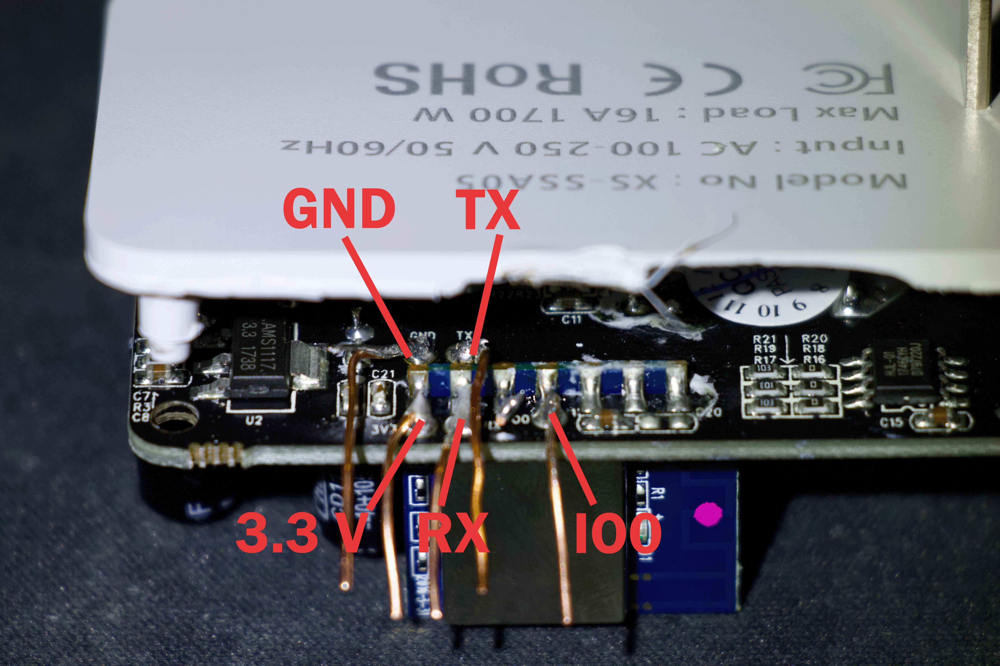

## Links

[Amazon](https://www.amazon.com/gp/product/B07KP3HQR4)

[Manufacturer Alibaba](https://www.alibaba.com/product-detail/XS-SSA05-220V-US-standard-electrical_62365683004.html)

[FCC Pictures](https://fcc.report/FCC-ID/2AL65-XSSSA05/3627360.pdf)


## Initial Install

This device requires the use of a serial connection for the first upload. Ensure that you use a serial adapter to connect to the device and upload the firmware.
It cannot be converted to ESPHome using tuya-convert or tuya-cloudcutter.

To flash the device, you must attach GND, 3.3V, RX, and TX, and bridge IO0 to ground. You may need to hold down the button while powering on the device to put it into bootloader mode.

DO NOT ATTACH MAIN AC POWER TO DEVICE WHEN FLASHING



## GPIO Pinout

| GPIO Pin | Function                  |
| -------- |---------------------------|
| GPIO0    | Red Status LED (External) |
| GPIO1    | None                      |
| GPIO2    | None                      |
| GPIO3    | HLW8012 SELi              |
| GPIO4    | Blue LED (Internal)       |
| GPIO5    | HLW8012 CF                |
| GPIO9    | None                      |
| GPIO10   | None                      |
| GPIO12   | Relay 1                   |
| GPIO13   | Button 1                  |
| GPIO14   | HLW8012 CF1               |
| GPIO15   | Blue Link LED (External)  |
| GPIO16   | None                      |
| GPIO17   | ADC Input 1               |

## Basic Configuration

```yaml
esphome:
  name: xs-ssa05
  friendly_name: XS SSA05 Smart Plug

esp8266:
  board: esp01_1m

# Enable logging
logger:

# Remove the following line if you're not using Home Assistant or your switch will restart every now and again
api:

ota:

wifi:
  ssid: !secret wifi_ssid
  password: !secret wifi_password

binary_sensor:
  # Button (GPIO13)
  - platform: gpio
    name: "XS-SSA05 Button"
    pin:
      number: GPIO13
      mode: INPUT_PULLUP
      inverted: True
    on_press:
      - switch.toggle: relay

  # Device status
  - platform: status
    name: "XS-SSA05 Status"

sensor:
  # WiFi Signal
  - platform: wifi_signal
    name: "XS-SSA05 WiFi Signal"
    update_interval: 60s

  # HLW8012 Power Sensor
  - platform: hlw8012
    sel_pin:
      number: GPIO03
      inverted: True
    cf_pin: GPIO05
    cf1_pin: GPIO14
    current:
      name: "XS-SSA05 Current"
      accuracy_decimals: 2
    voltage:
      name: "XS-SSA05 Voltage"
      accuracy_decimals: 2
    power:
      name: "XS-SSA05 Power"
      accuracy_decimals: 2
    energy:
      name: "XS-SSA05 Energy"
      accuracy_decimals: 2
      filters:
        - multiply: 0.001 # Convert Wh to kWh

switch:
  # Relay (GPIO12)
  - platform: gpio
    name: "XS-SSA05 Relay"
    pin: GPIO12
    id: relay
    restore_mode: ALWAYS_OFF
    on_turn_on:
      - output.turn_on: relay_led
    on_turn_off:
      - output.turn_off: relay_led

time:
  - platform: sntp
    id: my_time

status_led:
  # Status LED (Blue LED on GPIO15)
  pin:
    number: GPIO15
    inverted: False

output:
  # Red LED for Relay Status (GPIO0)
  - platform: gpio
    pin:
      number: GPIO0
      inverted: True
    id: relay_led
```

## Notes

Opening the device can be tricky. Here’s a helpful method to open it:

- Position the plug face-up on top of the jaws of a vice or two parallel flat surfaces, ensuring only the outer shell rests on them.
- Use a small punch to hammer through the ground hole and pop the rear cover and PCB out of the back.

Additionally, the GND and TX pins are difficult to access. A precision soldering iron is recommended to solder leads to these pins.
You may need to bend and hold the back case open while soldering.
