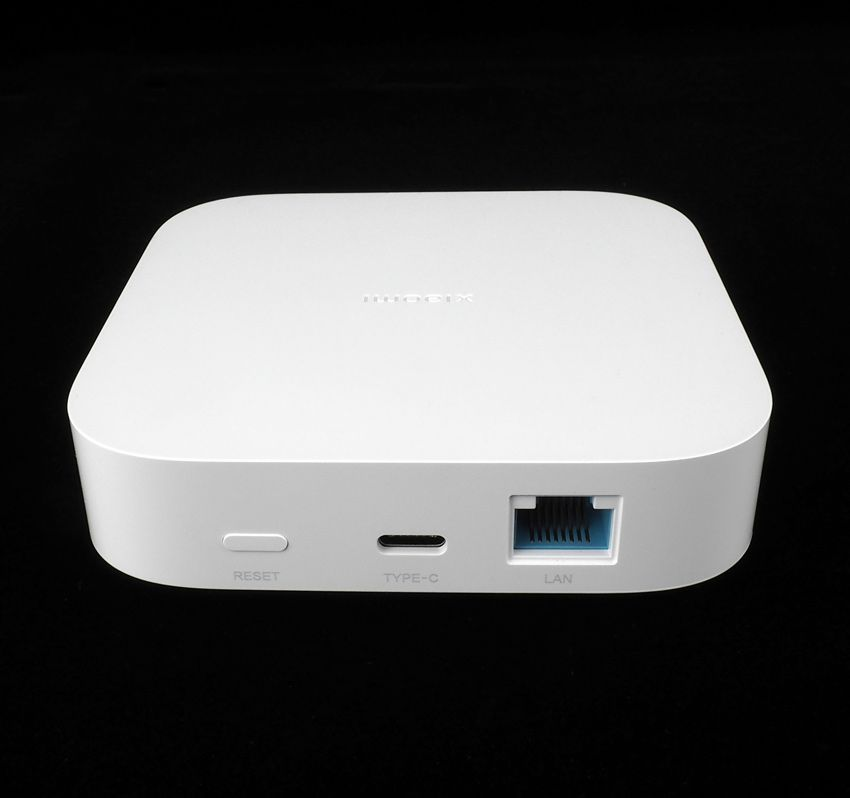

The Xiaomi Smart Multi Mode Gateway 3 is a Zigbee gateway that can be used to connect Zigbee devices to your network.

It is based on the EFR32MG21 SoC and supports Zigbee 3.0.

The gateway can be controlled via the Xiaomi Home app and can be integrated with Home Assistant using the ESPHome integration.

## Configuration

```yaml
---
substitutions:
  name: zb-gw03-coordinator
  device_description: "Ethernet Zigbee Gateway based Zigbee Coordinator"

esphome:
  name: ${name}
  comment: ${device_description}
  min_version: 2024.6.0
  on_boot:
    priority: 600
    then:
      - switch.turn_off: download_mode
      - switch.turn_on: zigbee_reset

esp32:
  board: esp-wrover-kit
  framework:
    type: esp-idf

external_components:
  - source: github://oxan/esphome-stream-server@master

api:
mqtt:
  broker: !secret mqtt_broker

ota:
  platform: esphome

logger:
  level: DEBUG

uart:
  id: uart_zigbee
  rx_pin: GPIO4
  tx_pin: GPIO2
  baud_rate: 115200

stream_server:
  uart_id: uart_zigbee
  port: 6638

switch:
  - platform: restart
    name: "${name} Restart"

  - platform: template
    id: zigbee_reset
    name: "${name} Zigbee Reset"
    turn_on_action:
      - switch.turn_on: zigbee_rst
      - delay: 10ms
      - switch.turn_off: zigbee_rst

  # SM-011 V1.0 nRST
  - platform: gpio
    id: zigbee_rst
    pin: GPIO13
    name: "${name} Zigbee nRST"
    inverted: true
    internal: true
    restore_mode: ALWAYS_OFF

  # SM-011 V1.0 PA00
  - platform: gpio
    id: download_mode
    pin: GPIO12
    name: "${name} Zigbee Download Mode"
    inverted: true
    restore_mode: ALWAYS_OFF
  
  - platform: template
    id: zigbee_pairing_mode
    name: "${name} Toggle pairing mode"
    turn_on_action:
      - switch.turn_on: download_mode
      - delay: 5s
      - switch.turn_off: download_mode

light:
  - platform: monochromatic
    name: "${name} green led"
    output: output0

output:
  - platform: ledc
    pin: GPIO14
    id: output0
    inverted: true

mdns:
  services:
    - service: _tube_zb_gw_efr32
      protocol: _tcp
      port: 6638
      txt:
        name: ZB-GW03
        version: 1.0
        radio_type: ezsp
        baud_rate: 115200
        data_flow_control: software

wifi:
  ssid: !secret wifi_ssid
  password: !secret wifi_password

#ethernet:  # This cannot be enabled at the same time as wifi
#  type: LAN8720
#  mdc_pin: GPIO23
#  mdio_pin: GPIO18
#  clk_mode: GPIO17_OUT
#  phy_addr: 1
#  power_pin: GPIO16
  
i2c:
  - id: i2c_bus
    sda: GPIO33
    scl: GPIO32
    scan: true

binary_sensor:
  - platform: gpio
    name: "${name} Enable Pairing Mode"
    internal: true
    pin:
      number: GPIO34
      inverted: true
    on_press:
      - switch.turn_on: download_mode
      - delay: 5s
      - switch.turn_off: download_mode
```

## References

https://github.com/syssi/esphome-zb-gw03

https://github.com/digiblur/Tasmota/tree/development/zigbee_router
