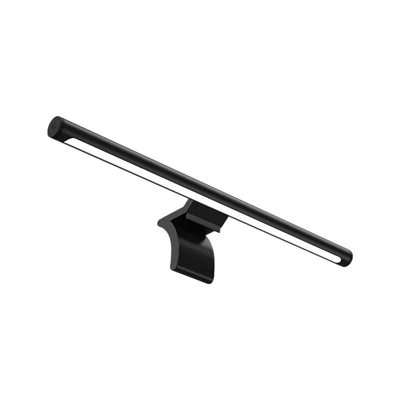

The Xiaomi Mi Computer Monitor Light Bar 1S is a smart CWWW (Cold+Warm White Light) LED lamp, produced by Yeelight for the Xiaomi Mi brand. It is an improved version of the previous generation Mi Computer Monitor Light Bar, which adds WiFi connectivity and uses BLE for communication with the rotating dimmer device. Dimmer supports single and long press action, regular and pressed rotation.

An [ESPHome package](https://github.com/vanzi11a/esphome-xiaomi_monitor_light_bar_s1) was created, which makes it possible to control the lamp from Home Assistant, and with the included BLE dimmer.

## Features

### No reliance on Xiaomi Cloud

That's the most obvious one. The lamp is fully controlled by your Home Assistant installation.

### Full support for BLE dimmer, mimicking the stock firmware behaviour

- Single press toggles light
- Rotation changes brightness
- Rotation with pressed button changes white temperature
- Long press cycles between presets

### Full support for light presets

#### Original presets

Following presets from the stock firmware are provided:

- Office - 4500k Temperature, 100% Brightness
- Reading - 5000k Temperature, 100% Brightness
- Leisure - 4000k Temperature, 50% Brightness
- Computer - 2700k Temperature, 50% Brightness
- Warm - 3500k Temperature, 60% Brightness

Original firmware also included "Blinking" preset, which blinks the lamp 5 times. This is available as an optional service.

#### Custom presets

Using a provided generator script, custom presets could be defined.

## Documentation

Information on how to obtain the bindkey for the remote, configure ESPHome, and flash the device is provided:

- [The GitHub repo](https://github.com/vanzi11a/esphome-xiaomi_monitor_light_bar_s1)
- [Documentation index](https://github.com/vanzi11a/esphome-xiaomi_monitor_light_bar_s1/blob/main/README.md)
