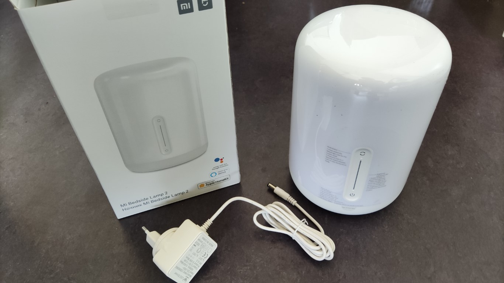

The Bedside Lamp 2 is a smart RGBWW LED lamp, produced by Yeelight for the Xiaomi Mijia brand. It can be controlled via the WiFi network and from a touch panel on the front of the device. The touch panel contains a power button, a button that changes the color of the light and a slider that can be used to change the brightness of the light.

An [external component](https://github.com/mmakaay/esphome-xiaomi_bslamp2) was created for ESPHome, which makes it possible to fully control every aspect of the lamp and to integrate the lamp in your Home Assistant setup or any other setup if you can make use of MQTT.

## Features

* The lamp **integrates easily with Home Assistant** using the ESPHome integration.

* **The lamp no longer phones home to the Mijia Cloud.** Using this firmware, you can rest assured
  that the network traffic is limited to your own network. This matches the ideas behind Home
  Assistant, of providing a local home automation platform, that puts privacy first.

* **No more need for the LAN control option** to integrate the lamp with Home Assistant. Especially
  important, because Xiaomi decided in all their wisdom to remove LAN control from the device,
  breaking existing integrations.

* **The night light supports multiple colors**. The original firmware only supports a single warm
  white night light color.

* **Smooth light color transitions**, unlike the current version of the Yeelight integration. The
  Homekit integration does provide good transitions, but on my system, the color temperature white
  light mode is missing in the Home Assistant GUI.

* **Since the components of the lamp are exposed as ESPHome components, you don't have to stick with
  the lamp's original behavior.** You can hook up the lamp in your home automation as you see fit.
  Use the slider to control the volume of your audio set? Long press the power button to put your
  house in night mode? Use the illumination behind the slider bar to represent the progress of your
  sour dough bread bulk fermentation? Go ahead, make it so! :-)

* **All LEDs that are used for illumination of the front panel (power button, color button and
  10 LEDs for the brightness slider) can be controlled individually.** This means that you have
  12 LEDs in total to use as you see fit, instead of sticking with the behavior of the original
  firmware.

* **Possibilities to extend the device's functionality through hardware mods.** There are GPIO pins
  that are not in use. If "tinkerer" is your middle name, you can use those pins to come up with
  your own hardware hacks to extend the device's functionality.

## Documentation

All information on how to build, flash and configure the ESPHome firmware can be found in the component repository. Here are some useful links:

* [The GitHub repo](https://github.com/mmakaay/esphome-xiaomi_bslamp2)
* [Documentation index](https://github.com/mmakaay/esphome-xiaomi_bslamp2/blob/dev/README.md)
* [Quick start guide](https://github.com/mmakaay/esphome-xiaomi_bslamp2/blob/dev/README.md#quick-start-guide)
* [Flashing guide](https://github.com/mmakaay/esphome-xiaomi_bslamp2/blob/dev/doc/flashing.md)
* [Configuration guide](https://github.com/mmakaay/esphome-xiaomi_bslamp2/blob/dev/doc/configuration.md)
  and an [example.yaml](https://github.com/mmakaay/esphome-xiaomi_bslamp2/blob/dev/example.yaml)
* [Technical details](https://github.com/mmakaay/esphome-xiaomi_bslamp2/blob/dev/doc/technical_details.md)

## Contacting the author

* [Discussion thread on the Home Assistant community website](https://community.home-assistant.io/t/custom-firmware-esphome-xiaomi-bslamp2/284406)
* [Issues and feature requests on GitHub](https://github.com/mmakaay/esphome-xiaomi_bslamp2/issues)
* [ESPHome Discord Community](https://discord.gg/KhAMKrd) (user @MauriceM)
