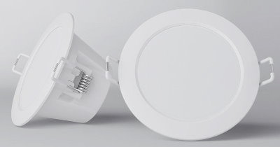

## Product Images



## Basic Configuration

```yaml
# Basic Config
---
substitutions:
  hostname: "xiaomidownlight"
  displayname: "ap_xiaomilight"
esphome:
  name_add_mac_suffix: true
  name: $hostname
  platform: ESP8266
  board: esp_wroom_02
  board_flash_mode: dout


# WiFi connection
wifi:
  ssid: !secret iot_wifi_ssid
  password: !secret iot_wifi_password
  power_save_mode: none
  fast_connect: true
  # Enable fallback hotspot (captive portal) in case wifi connection fails
  ap:
    ssid: "${displayname}"
    password: !secret ap_mode_password

captive_portal:

# Enable logging
logger:

# Enable Home Assistant API
api:
  reboot_timeout: 0s
  encryption:
    key: !secret api_encryption_key

ota:
  password: !secret ota_password

output:
  - platform: esp8266_pwm
    pin: GPIO12
    id: out_cw

  - platform: esp8266_pwm
    pin: GPIO15
    id: out_ww


light:
  - platform: cwww
    name: Спот
    cold_white: out_cw
    warm_white: out_ww
    cold_white_color_temperature: 5700 K
    warm_white_color_temperature: 3000 K
```
