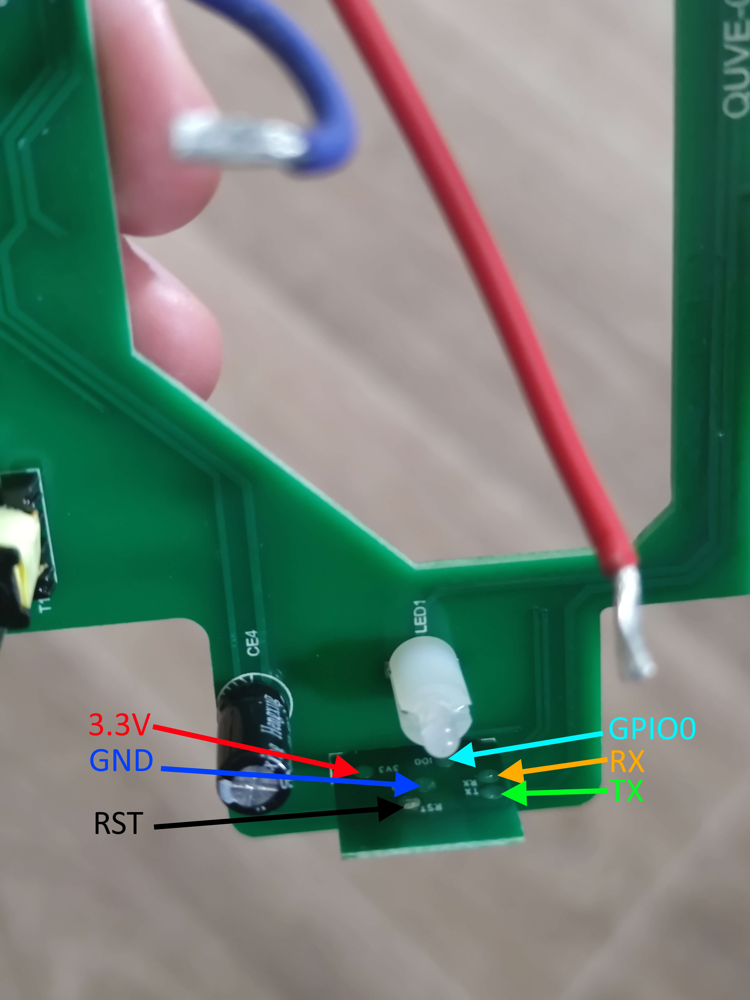
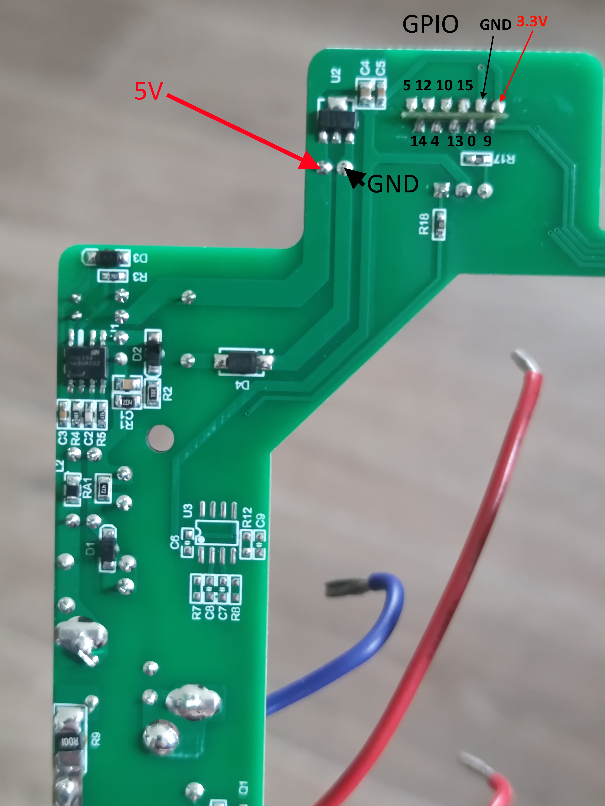

## Manufacturer

[XtendLan](https://www.xtendlan.cz/)


The LEDs for active sockets are not controlled separately, they are directly connected to the same pin as the relay.

The RX and TX pins are missing on the main board, so for flashing, the testpad on the ESP board must be used.

There are some unused GPIO pins exported to the main board. More information can be found in the picture.

## Pinout picture




## GPIO Pinout

| Pin    | Function            |
| ------ | ------------------- |
| GPIO0  | Button 1            |
| GPIO9  | Button 2            |
| GPIO13 | Status LED          |
| GPIO5  | Relay 1             |
| GPIO12 | Relay 2             |

## Basic Configuration

```yaml
substitutions:
  name: socket
  friendly_name: "Socket 1"
  location: Anywhere

esphome:
  name: ${name}
  friendly_name: socket

esp8266:
  board: esp8285

# Enable logging
logger:

# Enable Home Assistant API
api:

ota:
  password: "[redacted]"

web_server:
  port: 80

wifi:
  ssid: !secret wifi_ssid
  password: !secret wifi_password

  # Enable fallback hotspot (captive portal) in case wifi connection fails
  ap:
    ssid: ${friendly_name} Hotspot
    password: !secret ap_password

captive_portal:

binary_sensor:
  - platform: gpio
    pin:
      number: GPIO0
      mode:
        input: true
        pullup: true
      inverted: true
    name: ${friendly_name} Button 1
    on_press:
      - switch.toggle: relay1
  - platform: gpio
    pin:
      number: GPIO9
      mode:
        input: true
        pullup: true
      inverted: true
    name: ${friendly_name} Button 2
    on_press:
      - switch.toggle: relay2
  - platform: status
    name: ${friendly_name} Status

switch:
  - platform: gpio
    name: ${friendly_name} rele 1
    pin: GPIO12
    id: relay1
  - platform: gpio
    name: ${friendly_name} rele 2
    pin: GPIO5
    id: relay2

status_led:
  pin:
    number: GPIO13
    inverted: yes

sensor:
  # WiFi signals strength sensor
  - platform: wifi_signal
    name: ${friendly_name} WiFi Signal Sensor
    update_interval: 60s


text_sensor:
  # IP address of device. Not really needed for HA (as HA already knows it), but for showing on the display during startup. The startup screen will leave on if no instance connects to the API.
  - platform: wifi_info
    ip_address:
      name: ${friendly_name} IP address
      id: ip_address
```
