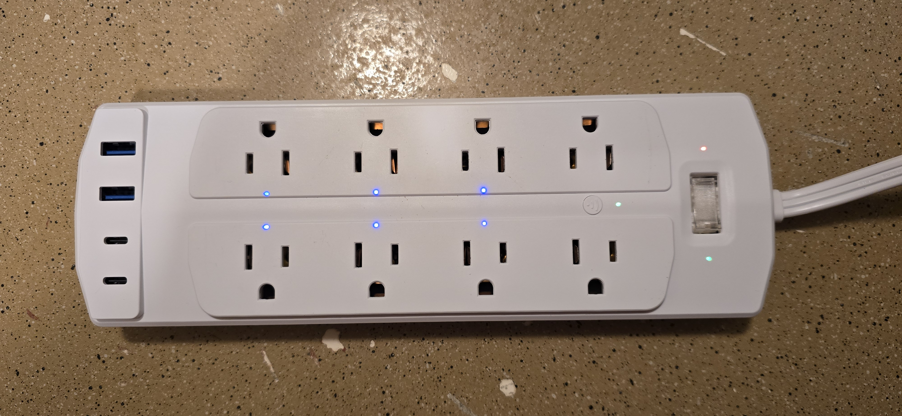
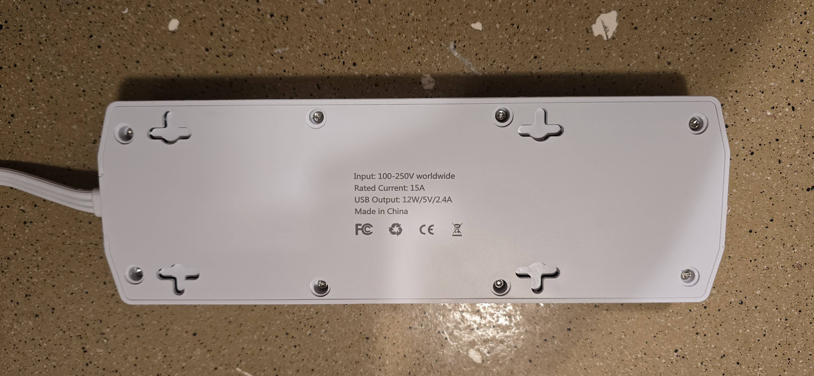
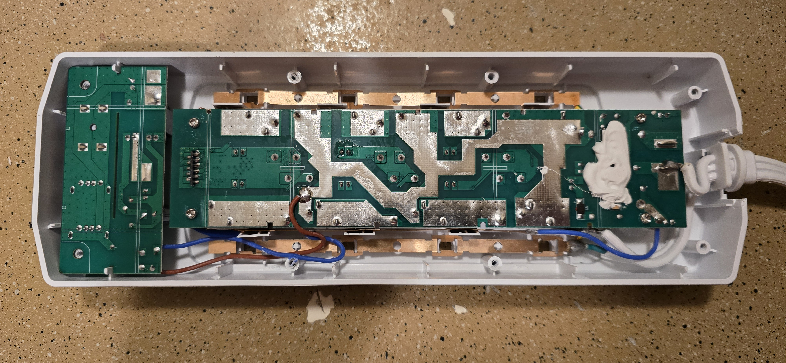
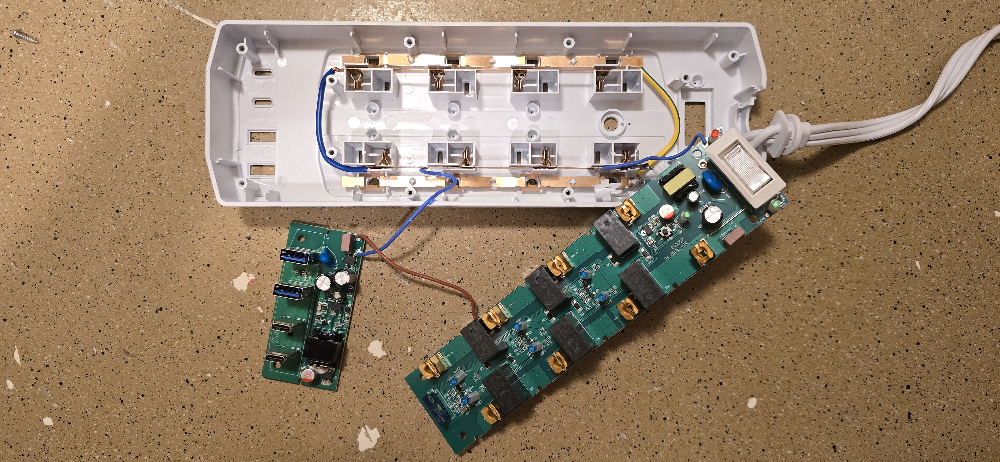
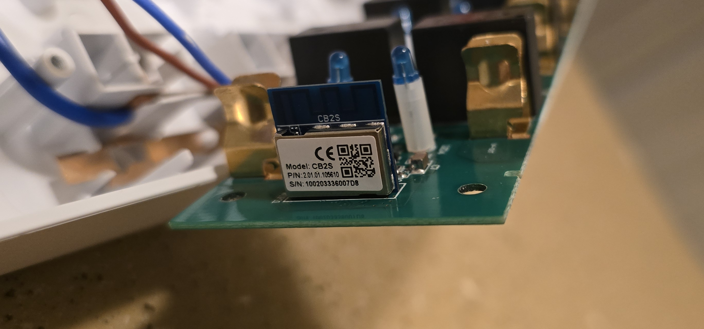
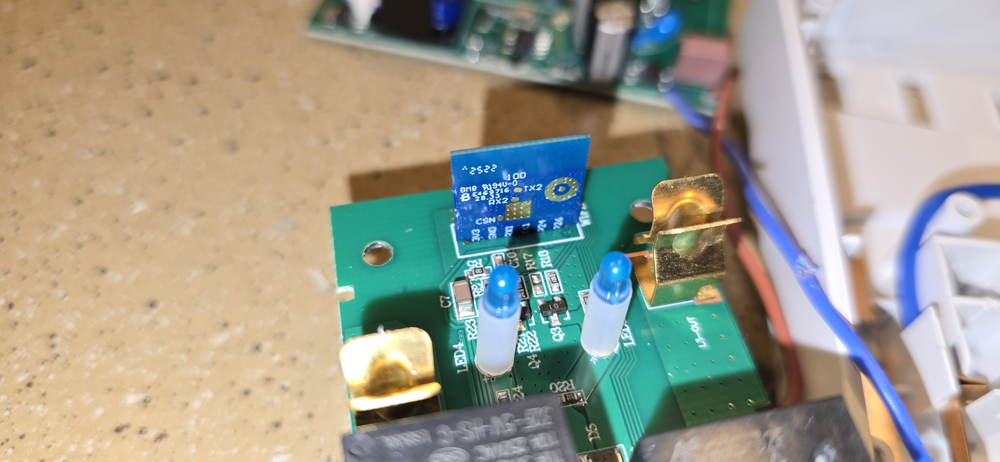
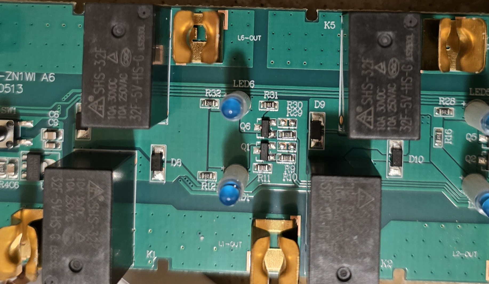

## Description

The Yozisital Surge Protector has a total of eight outlets, with six outlets individually software switchable. The extra two outlets and four USB ports are not software switchable.
The on\off toggle button controls power to the whole board while the connect button (with default firmware) has the dual function of toggling power to all software switchable plugs and placing the integrated chip into pairing mode.
The device is manufactured under the brand name _**Yozisital**_ and can be found on [Amazon](https://www.amazon.com/dp/B0DZWLRKGW) as well as other various sites. (ASIN: B0DZWLRKGW)

Internally the strip contains a CB2S module, which uses the BK7231N controller.
There are two separate boards; one for the mains and one for the USB ports.
I am no electronics engineer, but the strip has an advertised rating of 1,200 joules even though there is only one MOV present on the main board (marked as VDK 10D471K).
There doesn't seem to be an exact datasheet available for this specific MOV, but similar MOVs are only rated for about 65-85 joules.
Additionally, each outlet has an inline diode (marked as A7).
These diodes may or may not add to the joules rating, but I cannot identify if they are transient voltage suppression diodes or not.
There is also an inline fuse for the overall mains.
The USB board has a similar circuit with a MOV and diodes.

The input voltage for the device is 100-250V worldwide with a rated current of 15A. USB output is 12W/5V/2.4A

## Disassembly

The device is fairly easy to disassemble.

Start by removing the eight pads from the bottom side of the device.
This will reveal eigth pitted\tamper resistant torx screws.
Once the screws are removed, you will be able to remove the back plate by slightly lifting the strain relief section of the power cord.
You will then see four more pitted\tamper resistant torx screws.
These screws were a slightly smaller size for which I did not have a toolhead, but I was able to break off the center stub using a flathead screwdriver and then use the same toolhead at an angle to remove each screw.
After all screws have been removed, you will be able to lift the main board from the casing.
The USB board should already be free to lift as it is not held by any screws.
You will find the CB2S module at the end where the USB board resides.
The module can easily be desoldered and extracted for easier flashing, or you can tack-solder leads if you wish.
You will need leads for the `TX`, `RX`, `3.3V`, `GND`, and `CEN` pins.

When you are ready to reassemble the device, be sure the lead wires for the USB board do not get pinched by the casing.
One of my wires already had the insulation compromised due to being pinched.
So, I wrapped both leads in electrical tape to futher protect them and routed them away from the point of failure before reassembling the device.

## Photos















## Flashing

I am unsure if this device is vulnerable to `tuya-cloudcutter` or `tuya-convert` as I did not attempt to use them.
Instead, I flashed the device by desoldering the chip from the main board and using test leads with `ltchiptool` to overwrite its firmware after creating a dump of the original firmware.
A pinout for the CB2S module is available on the [LibreTiny site](https://docs.libretiny.eu/boards/cb2s/#pinout).
The chip operates at 3.3V so, be sure to set your voltage correctly.

You will need to briefly short the `CEN` pin to ground during the flashing process.
I was able to do so by tapping the pin with an additional test lead connected to ground at the exact moment `ltchiptool` was attempting to connect.
This will require patience and finesse as the timing must be exact to cause the chip to enter download mode.

The following is an excellent video guide for this process:

[](https://www.youtube.com/watch?v=t0o8nMbqOSA)

## GPIO Pinout

| Pin | Function   |
| --- | ---------- |
| P6 | Outlet 1   |
| P7  | Outlet 2   |
| P8 | Outlet 3   |
| P23 | Outlet 4   |
| P24 | Outlet 5   |
| P26 | Outlet 6   |
| P11  | Button     |
| P10 | Status LED |

## Configuration

Some sections containing required or default ESPHome configuration items have been removed.
Please ensure you add them to the configuration before use.
Also note that this configuration is almost untouched from what was generated by the binary firmware analyzer in `ltchiptool`.
Many thanks to the author of this awesome tool!

```yaml
esphome:
  name: power-strip

bk72xx:
  board: cb2s

switch:
  - platform: gpio
    id: switch_1
    name: Relay 1
    pin: P6
    on_turn_on:
      - light.turn_on: light_status
    on_turn_off:
      - light.turn_off: light_status
  - platform: gpio
    id: switch_2
    name: Relay 2
    pin: P7
    on_turn_on:
      - light.turn_on: light_status
    on_turn_off:
      - light.turn_off: light_status
  - platform: gpio
    id: switch_3
    name: Relay 3
    pin: P8
    on_turn_on:
      - light.turn_on: light_status
    on_turn_off:
      - light.turn_off: light_status
  - platform: gpio
    id: switch_4
    name: Relay 4
    pin: P23
    on_turn_on:
      - light.turn_on: light_status
    on_turn_off:
      - light.turn_off: light_status
  - platform: gpio
    id: switch_5
    name: Relay 5
    pin: P24
    on_turn_on:
      - light.turn_on: light_status
    on_turn_off:
      - light.turn_off: light_status
  - platform: gpio
    id: switch_6
    name: Relay 6
    pin: P26
    on_turn_on:
      - light.turn_on: light_status
    on_turn_off:
      - light.turn_off: light_status

binary_sensor:
  - platform: gpio
    id: binary_switch_all
    pin:
      number: P11
      inverted: true
      mode: INPUT_PULLUP
    on_press:
      then:
        - switch.toggle: switch_1
        - switch.toggle: switch_2
        - switch.toggle: switch_3
        - switch.toggle: switch_4
        - switch.toggle: switch_5
        - switch.toggle: switch_6

light:
  - platform: status_led
    id: light_status
    pin:
      number: P10
      inverted: true
