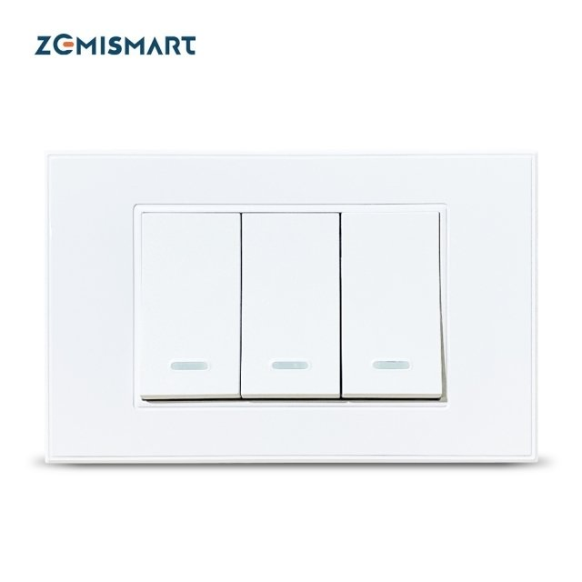

This switch comes in three variants with 1 to 3 gangs (TB21, TB22, TB23).
They all use the same config, you just drop the extra relays/inputs

Manufacturer: [Zemismart](https://www.zemismart.com/products/zemismart-tb21-smart-wifi-luxury-wall-light-switch-1-2-3-gangs-compatible-with-smart-life-app-alexa-google-home-voice-control)

## How to flash

1. Open

  Remove the button front, no screws, just use a small pointed tool to loose the holds on the sides
  

  There is no need to remove the circuit from the case, but it be easily lifted up from the sides. It is just held by the pin headers connecting to the relays board below


2. Pins

  There are pads for RX, TX, 3.3v, GND and I00 nicely marked on the back of the board. You can just insert pins without soldering.
  Use this image to map the right connectors.
  


## Basic Config

The green leds are used as status light and also as backlight, when the gang is off.
It can be controlled to be always off.

```yaml
substitutions:
  node_id: switch-living
  verbose_name: "Switch Living"

  switch_restore_mode: ALWAYS_OFF
  switch1_name: Lamp 1
  switch2_name: Lamp 2
  switch3_name: Lamp 3


#####

esphome:
  platform: ESP8266
  board: esp01_1m

binary_sensor:
  - platform: gpio
    id: button1
    pin:
      number: GPIO16
      inverted: true
    on_click:
      - switch.toggle: relay1

  - platform: gpio
    id: button2
    pin:
      number: GPIO5
      inverted: true
      mode: INPUT_PULLUP
    on_click:
      - switch.toggle: relay2

  - platform: gpio
    id: button3
    pin:
      number: GPIO4
      inverted: true
      mode: INPUT_PULLUP
    on_click:
      - switch.toggle: relay3

switch:
  - platform: gpio
    name: ${switch1_name}
    pin: GPIO13
    id: relay1
    restore_mode: ${switch_restore_mode}
  - platform: gpio
    name: ${switch2_name}
    pin: GPIO12
    id: relay2
    restore_mode: ${switch_restore_mode}
  - platform: gpio
    name: ${switch3_name}
    pin: GPIO14
    id: relay3
    restore_mode: ${switch_restore_mode}

light:
  - platform: status_led
    id: led_green
    name: ${verbose_name} Backlight
    restore_mode: ALWAYS_ON
    entity_category: config
    pin:
      number: GPIO0
      inverted: true


```
