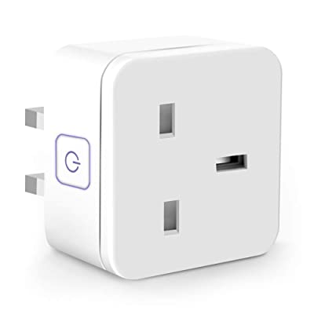

## Product Images



## GPIO Pinout

| Pin    | Function       |
| ------ | -------------- |
| GPIO01 | CSE7766 Tx     |
| GPIO03 | CSE7766 Rx     |
| GPIO12 | Button 1       |
| GPIO13 | LED 1 inverted |
| GPIO14 | Relay 1        |

```yaml
substitutions:
  device_name: jhg01b1
  friendly_name: JH-G01B1

esphome:
  name: "${device_name}"

esp8266:
  board: esp01_1m

logger:

api:

web_server:
  port: 80

binary_sensor:
  - platform: gpio
    pin:
      number: GPIO12
      mode: INPUT_PULLUP
      inverted: True
    name: "${friendly_name} Button"
    id: "${device_name}_button"
    on_press:
      - switch.toggle: "${device_name}_relay"

switch:
  - platform: gpio
    name: "${friendly_name}"
    id: "${device_name}_relay"
    pin: GPIO14
    on_turn_on:
      - output.turn_on: led
    on_turn_off:
      - output.turn_off: led
    restore_mode: ALWAYS_ON

output:
  - platform: gpio
    pin: GPIO13
    inverted: true
    id: led

uart:
  rx_pin: RX
  baud_rate: 4800

sensor:
  - platform: cse7766
    current:
      name: ${friendly_name} Current
    voltage:
      name: ${friendly_name} Voltage
    power:
      name: ${friendly_name} Power
    energy:
      name: ${friendly_name} Energy
  - <<: !include includes/sensors/uptime.yaml
  - <<: !include includes/sensors/wifi_signal.yaml

text_sensor:
  - <<: !include includes/text_sensor/version.yaml
  - <<: !include includes/text_sensor/wifi_info.yaml

<<: !include includes/default.yaml
```
