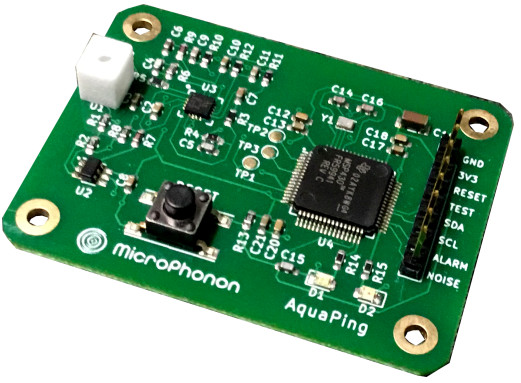

The AquaPing is a smart sensor that is designed to listen for very weak, high frequency acoustics that may accompany a pressurized plumbing leak.  It is best deployed as a stand-off sensor similar to a smoke alarm -- no contact with plumbing is needed. It can also detect leaks behind walls. It has been developed to detect the onset of water leaks, but users are encouraged to experiment with pressurized gases, refrigerants, and steam.

Production was funded with a campaign at [Crowd Supply](https://www.crowdsupply.com/microphonon/aquaping) where sensor boards can be purchased. This is an open-source hardware project to allow the community to verify that it is physically impossible to use this device to eavesdrop on conversations. Privacy is assured.

