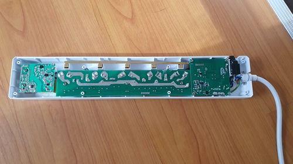

## Product description

This is a Bauhn (Aldi) AP5W-0624 It is a 5-outlet powerboard with separate "always on" 2xUSB-A and 2xUSB-C outlets.  Purchased in July 2024.

The powerboard incorporates a Tuya CBU module incorporating the BK7231N processor.
To realign for ESPHome use I went straight for the "solder and reprogram" method rather than eploring other software only repogramming options.
The unit is easy to open with "Triangle" socket screws on the back. The CBU module is fairly accessable to solder on the 5 required wires.

https://developer.tuya.com/en/docs/iot/cbu-module-datasheet?id=Ka07pykl5dk4u




The powerboard also incorporates power monitoring using the BL0942 chip.

Other features of the board are:

1) Separate relays for each power outlet
2) Surge protection (indicated by an always on green LED)
3) Single addressable blue LED
4) Single momentary push button
5) Resettable overload (10A)

https://www.aldi.com.au/special-buys/special-buys-sat-29-june/saturday-detail-wk26/ps/p/5-way-surge-protector-powerboard-with-wi-fi-and-meter-reading/

## Pinout

This powerboard incorporates the CBU module

https://developer.tuya.com/en/docs/iot/cbu-module-datasheet?id=Ka07pykl5dk4u


### Programming header pinout

| Pin   | Comment                                                 |
| ----- | ------------------------------------------------------- |
| TX1   |   Transmit (connect to Rx on programmer)                |
| RX1   |   Receive  (connect to Tx on programmer)                |
| 3.3v  |   3.3V                                                  |
| Gnd   |   Ground                                                |
| CEN   |  Ground to access programming mode                      |

### Internal pinout

| Pin    | Function                      |
| ------ | ----------------------------- |
| P22    | Push Button                    |
| P28    | Status LED                    |
| P6     | Relay #1                      |
| P7     | Relay #2                      |
| P8     | Relay #3                      |
| P9     | Relay #4                      |
| P24    | Relay #5                      |
| TX1    | Comms to BL0942               |
| RX1    | Comms to BL0942               |

## Button

The setup will turn on plugs 1 to 4 with each short press, then once all plugs are on, turn off plugs 1 to 4 with each short press.

A long press will toggle all plugs on or off.

## Basic Configuration

```yaml
# Bauhn 5 way powerboard with individual socket switchng and BL0942 power monitoring.
# USB sockets are permanently on.
# There is only one controllable LED

substitutions:
  name: bunk-bedroom-power
  friendly_name: Bauhn Power Board
  relay_restore_mode: RESTORE_DEFAULT_OFF

esphome:
  name: bauhn-5-way-power-board
  comment: Bauhn 5 way powerboard with power monitoring

bk72xx:
  board: cbu

globals:
  - id: set_on
    type: "bool"
    restore_value: no
    initial_value: "1"

# Enable logging
logger:

# Enable Home Assistant API
api:

ota:
  - platform: esphome
    id: my_ota
    password: !secret ota_password

wifi:
  ssid: !secret wifi_ssid
  password: !secret wifi_password

  # Enable fallback hotspot (captive portal) in case wifi connection fails
  ap:
    ssid: "Bauhn-5-Way-Power-Board"
    password: "G5cDVW32MOE1"
    ap_timeout: 2min
    # Not sure but this device did not attach to my SSID without the ap_timeout set to 2 min WiFi a bit weak?

captive_portal:

text_sensor:
  - platform: libretiny
    version:
      name: LibreTiny Version

switch:
  - platform: gpio
    name: "${friendly_name} 1"
    pin: P6
    id: relay_1
    icon: mdi:power-socket-au
    restore_mode: ${relay_restore_mode}
  - platform: gpio
    name: "${friendly_name} 2"
    pin: P7
    id: relay_2
    icon: mdi:power-socket-au
    restore_mode: ${relay_restore_mode}
  - platform: gpio
    name: "${friendly_name} 3"
    pin: P8
    id: relay_3
    icon: mdi:power-socket-au
    restore_mode: ${relay_restore_mode}
  - platform: gpio
    name: "${friendly_name} 4"
    pin: P9
    id: relay_4
    icon: mdi:power-socket-au
    restore_mode: ${relay_restore_mode}
  - platform: gpio
    name: "${friendly_name} 5"
    pin: P24
    id: relay_5
    icon: mdi:power-socket-au
    restore_mode: ${relay_restore_mode}

light:
  - platform: status_led
    name: "${friendly_name} Status LED"
    id: blue_led
#   disabled_by_default: true
    pin:
      inverted: false
      number: P28

binary_sensor:
  - platform: gpio
    pin:
      number: P22
      mode:
        input: true
        pullup: true
      inverted: true
    name: "${friendly_name} Button"
    id: button1
    on_multi_click:
      - timing:
          - ON for at most 0.5s
          - OFF for at least 0.5s
        then:
          lambda: |-
            if ( id(set_on) ) {
              if (! id(relay_1).state  ) {
                id(relay_1).turn_on();
              } else if ( ! id(relay_2).state ) {
                id(relay_2).turn_on();
              } else if ( ! id(relay_3).state ) {
                id(relay_3).turn_on();
              } else if ( ! id(relay_4).state ) {
                id(relay_4).turn_on();
              } else if ( ! id(relay_5).state ) {
                id(relay_5).turn_on();
                id(set_on) = 0;
              } else {
                id(relay_1).turn_off();
                id(relay_2).turn_off();
                id(relay_3).turn_off();
                id(relay_4).turn_off();
                id(relay_5).turn_off();
              }
            } else {
              if ( id(relay_1).state  ) {
                id(relay_1).turn_off();
              } else if (  id(relay_2).state ) {
                id(relay_2).turn_off();
              } else if (  id(relay_3).state ) {
                id(relay_3).turn_off();
              } else if (  id(relay_4).state ) {
                id(relay_4).turn_off();
              } else if (  id(relay_5).state ) {
                id(relay_5).turn_off();
                id(set_on) = 1;
              } else {
                id(relay_1).turn_on();
                id(relay_2).turn_on();
                id(relay_3).turn_on();
                id(relay_4).turn_on();
                id(relay_5).turn_off();

              }
            }
      - timing:
          - ON for at least 0.5s
          - OFF for at least 0.2s
        then:
          lambda: |-
            if (id(relay_1).state ||
            id(relay_2).state ||
            id(relay_3).state ||
            id(relay_4).state ) {
              id(relay_1).turn_off();
              id(relay_2).turn_off();
              id(relay_3).turn_off();
              id(relay_4).turn_off();
              id(relay_5).turn_off();
            } else {
              id(relay_1).turn_on();
              id(relay_2).turn_on();
              id(relay_3).turn_on();
              id(relay_4).turn_on();
              id(relay_5).turn_on();
            }

uart:
  id: uart_bus
  tx_pin: TX1
  rx_pin: RX1
  baud_rate: 4800
  stop_bits: 1

sensor:
  - platform: bl0942
    uart_id: uart_bus
    voltage:
      name: '${friendly_name} Voltage'
    current:
      name: '${friendly_name} Current'
    power:
      name: '${friendly_name} Power'
      filters:
        multiply: -1
    energy:
      name: '${friendly_name} Energy'
    frequency:
      name: "${friendly_name} Frequency"
      accuracy_decimals: 2

    update_interval: 10s
```
