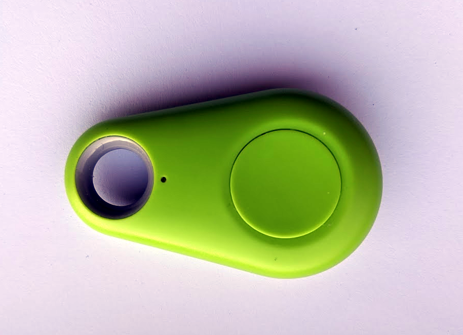

This example shows how to use a cheap BLE keyring tag to trigger
arbitrary events. An ESP32 is used, which provides a BLE peripheral.



These tags can be had for a couple of dollars each and run for several
months on a coin cell. Using the BLE features of ESPHome, you can use
these as small and cheap remotes to control any automation.

## Quickstart

Use the configuration block below for a basic setup which will provide a
binary_sensor that is momentarily turned on when the button is pressed.

You will need to find the MAC address of your tag. See the documentation
for `ble_client` for how to
find this out. You may also wish to change the name and id fields where
appropriate to suit your device(s).

Note that a maximum of three devices are supported due to limitations in
the ESP32's BLE stack.

## Configuration example

``` yaml
esp32_ble_tracker:

ble_client:
  # Replace with the MAC address of your device.
  - mac_address: FF:FF:20:00:0F:15
    id: itag_black

binary_sensor:
  - platform: template
    id: black_button
    name: "Black iTag Button"
    filters:
      delayed_off: 200ms

sensor:
# This entry registers and awaits notifications for the
# characteristic that signals button presses. Each time
# a notification is received, the corresponding binary_sensor
# is briefly toggled.
  - platform: ble_client
    type: characteristic
    ble_client_id: itag_black
    name: "Black iTag btn"
    service_uuid: 'ffe0'
    characteristic_uuid: 'ffe1'
    notify: true
    update_interval: never
    on_notify:
      then:
        - binary_sensor.template.publish:
            id: black_button
            state: ON
        - binary_sensor.template.publish:
            id: black_button
            state: OFF
# This entry queries the battery level. Some tags may not
# support this characteristic, you will see 'Unknown' in the
# HA frontend.
  - platform: ble_client
    type: characteristic
    ble_client_id: itag_black
    name: "Black iTag Battery"
    service_uuid: '180f'
    characteristic_uuid: '2a19'
    icon: 'mdi:battery'
    unit_of_measurement: '%'
# This entry queries polls the RSSI when the tag is connected.
  - platform: ble_client
    type: rssi
    ble_client_id: itag_black
    name: "Black iTag RSSI"
```

## Explanation

The first thing enabled is the `esp32_ble_tracker` component. This sets
up the BLE stack on the device and listens for available devices.

Next, the `ble_client` component will listen to devices discovered by
the tracker, and establish a connection to the given device when it is
available.

The `binary_sensor` provides a template sensor which will export to the
HA frontend the sensor that's switched by the BLE tag's button.

The first entry in the `sensor` component is used to configure the
specific Service and Characteristic UUIDs for an iTag's button. It also
enables BLE notifications and sets up an automation to toggle the
`binary_sensor` when a notification is received from the tag. Automatic
updates are disabled, there is no point querying the tag for the device
state, as we will be immediately notified when the button is pressed.

The next `sensor` entry listens for a well-known Service and
Chacteristic that is used by many BLE devices to give battery level
information. This sensor will be exposed in the HA frontend to determine
the state of the tag's battery. Note that many tags will not provide
this service, so you will not see a valid value. If not, you can remove
this from the config.
