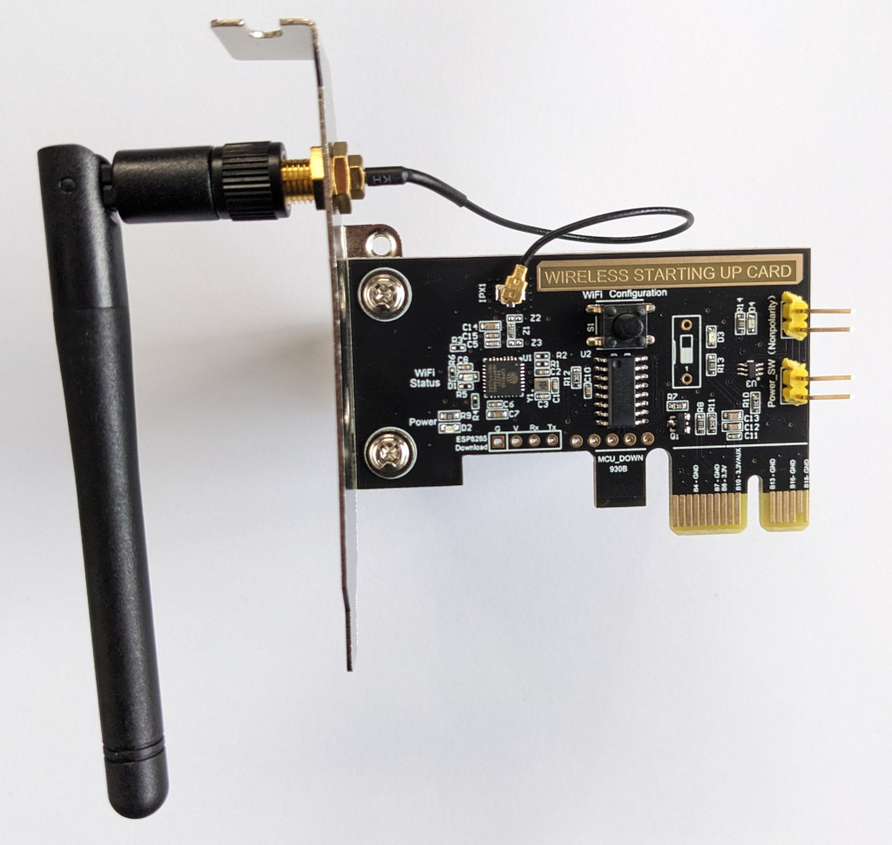

A simple remote control/monitor device for use with standard PCs.

Installed between the power button and the motherboard, it's able to simulate pressing the power button.
As the headers are connected directly together, there's no way to "lock out" the physical button as some similar devices offer.
It uses the PCIe power rails to determine whether the host PC is turned on, but this is reported to the ESP by a secondary MCU which pulses GPIO0.



## GPIO Pinout

| Pin    | Function | Notes                                                                                       |
| ------ | -------- | ----------------------------------------------------------------------------------------------------------------------------- |
| GPIO0  | INPUT    | Button on module PCB, used by OEM firmware for WiFi config (inverted); also receives a ~2.5Hz signal when the PC is turned on |
| GPIO12 | OUTPUT   | Wired to the PC power button / motherboard, to simulate pressing the power button                                             |
| GPIO13 | OUTPUT   | Status LED (inverted)                                                                                                         |

## Flashing

The module has a convenient row of `2.54mm` pitch throgh holes below the ESP8285 chip which provide power and serial communication for the ESP.
To enter flashing mode, hold the "WiFi Configuration" button down while powering up the ESP.

| ESP8285 Pin | USB Serial Pin | Comments                                                                                                                          |
| ----------- | -------------- | --------------------------------------------------------------------------------------------------------------------------------- |
| G           | Ground         | If using a dedicated power supply with the USB programmer, make sure that the GND for the programmer and power supply are linked! |
| V           | 3V3            | Connect to dedicated 3V3 1A power supply if encountering brown out                                                                |
| Rx          | TX             |                                                                                                                                   |
| Tx          | RX             |                                                                                                                                   |

Connect all 4 pins as indicated, hold the "WiFi Configuration" button down and _then_ power up the device and _then_ plug in the USB programmer.
The module should immediately enter boot loader mode and should be "discoverable" with `esptool.py`.

While not strictly necessary, you may wish to backup the flash content before overwriting with ESPHome.

```shell
# Confirm that you can "see" the module
❯ esptool.py --port /dev/ttyUSB0 chip_id

# Double check the type/size of the flash chip
❯ esptool.py --port /dev/ttyUSB0 flash_id

# Read out the flash; in this case, the `flash_id` command indicated that the ESP had 1MB of built in flash memory
❯ esptool.py --port /dev/ttyUSB0 read_flash 0x000000 0x100000 flash_backup.bin
```

If you are an experienced ESPhome dev/user -- you know what to do from here.  Just flash the device however you like.

If you are looking for more of a step-by-step guide -- you can flash your new device using a Chromium-based browser (Chromium, Chrome, Edge) by going to https://web.esphome.io/ and clicking on 'Install for first-time' (or whatever wording they have). Once your device has been flashed, power cycle the device, and then use your phone or a WiFi capable device to search for the new ESPhome AP that will be broadcast by the card.  Once you have connected to the ESPhome AP, you can then tell the device what your home's WiFi network is and the password for getting it connected.

## Basic Configuration

The configuration below covers just the basics for getting the core functionality (turning PC on/off and seeing its status) usable in ESPHome.
Depending on your specific needs, more configuration may be needed.
E.G.: most motherboards will interpret the power button being pressed for 5+ seconds to mean "shutdown _now_". Exposing `GPIO12` to Home Assistant _directly_ as a gpio switch may result in the PC powering off a few seconds after it's powered on.

As GPIO0 is shared by the "WiFi Configuration" button and the PC power status signal, the button isn't included in the config below; if you wish to use it in your configuration, you'll need to determine how to reliably discern a button press from the "PC is on" signal (which appears to be around 2.5Hz / 150 pulses per minute; a threshold of 60 pulses per minute is used here to ensure detection).

```yaml
substitutions:
  name: pc-power-sw
  friendly_name: PC Power Switch
  friendly_name_short: "PC Power"
  devicename: pc_power_switch

esphome:
  name: ${name}
  friendly_name: ${friendly_name}
  name_add_mac_suffix: false
  project:
    name: esphome.web
    version: '1.0'

esp8266:
  board: esp8285
  early_pin_init: False

mdns:
  disabled: False

logger:
  level: INFO

script:
  - id: regular_press
    mode: single
    then:
      - output.turn_on: out_relay
      - delay: .5s
      - output.turn_off: out_relay

status_led:
  pin:
    number: GPIO13
    inverted: True

sensor:
  - platform: pulse_meter
    id: power_status_pulses
    pin: GPIO0
    timeout: 5s

  - platform: wifi_signal # Reports the WiFi signal strength/RSSI in dB
    name: "WiFi Signal dB"
    id: wifi_signal_db
    update_interval: 600s
    entity_category: "diagnostic"

  - platform: copy # Reports the WiFi signal strength in %
    source_id: wifi_signal_db
    name: "WiFi Signal Percent"
    filters:
      - lambda: return min(max(2 * (x + 100.0), 0.0), 100.0);
    unit_of_measurement: "Signal %"
    entity_category: "diagnostic"
    device_class: ""


  - platform: uptime
    name: ${devicename} Uptime in Days
    id: uptime_sensor_days
    update_interval: 60s
    on_raw_value:
      then:
        - text_sensor.template.publish:
            id: uptime_human
            state: !lambda |-
              int seconds = round(id(uptime_sensor_days).raw_state);
              int days = seconds / (24 * 3600);
              seconds = seconds % (24 * 3600);
              int hours = seconds / 3600;
              seconds = seconds % 3600;
              int minutes = seconds /  60;
              seconds = seconds % 60;
              return (
                (days ? String(days) + "d " : "") +
                (hours ? String(hours) + "h " : "") +
                (minutes ? String(minutes) + "m " : "") +
                (String(seconds) + "s")
              ).c_str();

time:
  - platform: homeassistant
    id: homeassistant_time

# Text sensors with general information.
text_sensor:
  # Expose ESPHome version as sensor.
  - platform: version
    name: $devicename Version
  # Expose WiFi information as sensors.
  - platform: wifi_info
    ssid:
      name: Network
    ip_address:
      name: $devicename IP
    bssid:
      name: $devicename BSSID

  # human readable update text sensor from sensor:uptime
  - platform: template
    name: Uptime Human Readable
    id: uptime_human
    icon: mdi:clock-start

switch:
  - name: "${friendly_name_short} Power"
    id: sw_pc_power
    on_turn_on:
    - logger.log: "Switch Turned On!"
    on_turn_off:
    - logger.log: "Switch Turned Off!"
    restore_mode: ALWAYS_OFF
    turn_on_action:
      script.execute: regular_press
    platform: template
    #lambda: |-
    #  if (id(power_status_pulses).state > 60.0f) {
    #    return true;
    #  } else {
    #    return false;
    #  }
    #Replace the lambda function above with the one below if you have inverted the relay output
    lambda: |-
      if (id(power_status_pulses).state > 60.0f) {
        return false;
      } else {
        return true;
      }

output:
  - platform: gpio
    id: out_relay
    #Inverts relay operation, this avoids force shutdown behavior on some motherboards. Uncomment here and replace the above lambda if you are having this problem.
    inverted: True
    pin: GPIO12

# Enable Home Assistant API
api:
  reboot_timeout: 0s

# Allow Over-The-Air updates
ota:
  - platform: esphome
# Allow provisioning Wi-Fi via serial
improv_serial:

wifi:
  # Set up a wifi access point
  ap: {}
  ssid: !secret wifi_ssid
  password: !secret wifi_password
  fast_connect: true
  reboot_timeout: 0s

# In combination with the `ap` this allows the user
# to provision wifi credentials to the device via WiFi AP.
captive_portal:

dashboard_import:
  package_import_url: github://esphome/example-configs/esphome-web/esp8266.yaml@main
  import_full_config: true

# To have a "next url" for improv serial
web_server:


#be SURE to use the esp web flasher or a USB flasher. The built-in OTA service only worked for me when I had the device fully powered (not on the USB 3.3V).
```

## Home Assistant Integration and Setup

**READ THIS LINE** -- There is a difference between configuring ESPhome **devices** in HA , and using the **ESPhome HA Add-On**.  The ESPhome Add-On is what you'll need to use in order to compile the ESPhome firmware for this device.

In your home assistant, go to "Settings -> Add-Ons -> Add-On Store"  Search for "ESPhome" and add the official ESPhome Add-On. Startup and go into the new ESPhome Addon.  Click on "Secrets" in the upper-right corner and add your home network's WiFi settings.

```yaml
# Your Wi-Fi SSID and password
wifi_ssid: "WiFi_Name_Here"
wifi_password: "password_here"

```

And click on "Save" (upper right corner).

Assuming that your HA is on the same network as your newly flashed PCI-E card, the ESPhome Add-On should automatically list the new device with the option to "Adopt" the new device.  Go ahead and "Adopt" it. **BUT DO NOT 'INITIALISE'**  You can click on 'Skip'.
Now click on "Edit" underneath your newly adopted device.  You can now copy the above configuration YAML and paste it into the text box on your adopted device.  Click on "Save" and then click on "Install".  I recommend selecting the option that allows you to create a binary file and save it to your computer in order to flash the new device from any number of methods.  Once you have your new binary file, you can flash it to your new device and it should automatically reboot itself.  

**Note:** If you flash the device using OTA while it is fully connected to your PC , it will boot-up and simulate a 'power-button-pressed' action on boot.  

The initial boot-up should have the device immediately seek-out and connect-to your home network.  But, you might notice that it also has created its own AP so that you can connect directly to it and input your home network's parameters.  In either case, you should be able to get your new device connected to your home network.  If your computer powers-down after a few moments -- check the YAML code above for **BOTH** of the commented out sections for getting around this issue.
