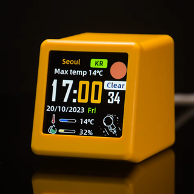
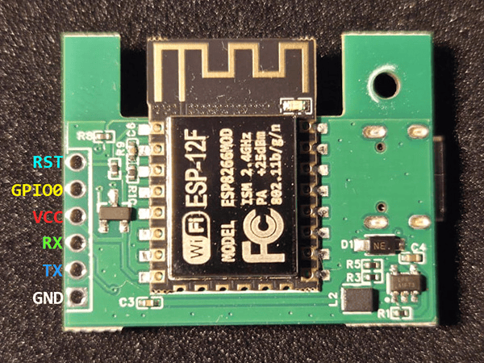

## Product Description

The GeekMagic Ultra is an LCD display designed to look like a mini computer.

It is USB-C powered and has an ESP8266 inside.

The LCD panel has a 28x28mm size resulting in a 240x240 pixel resolution.

## Product Images



## Flash ESPHome

Flashing the device can be done in 2 different ways.

### 1. Upload .bin file (using original firmware)(easiest)

The original firmware comes with the option to upload a custom .bin file.
This can be done by connecting to the device's access point over Wi-Fi.
Open a browser and navigate to the IP address displayed on the screen of the device.
Find the "Firmware update" section in the web interface and upload your .bin file.
The .bin file can be generated with ESPHome Device Builder using the correct config below.

### 2. Manual flashing via Serial (Disassembly needed)

If the first option is not usable for you, you can always flash the device manually by disassembling it first.
Unscrew the 2 screws at the bottom of the device and slide the plastic casing open from the back of the device.
Because this device doesn't have a USB to serial chip, we need to connect some wires to it in order to flash it.

Pinout:



**Note:** To enter flash mode, GPIO0 must be pulled to GND during power-up.

## Basic Configuration

**NOTE:**
LVGL is not supported on this model due to the small memory size of the board,
but it is supported on the GeekMagic Pro model (with ESP32 inside).
As of now, displaying content on the screen is limited to the use of custom lambdas.

```yaml
esphome:
  name: geek-magic-ultra
  friendly_name: geek-magic-ultra

esp8266:
  board: esp12e

# Enable logging
logger:

wifi:
  ssid: !secret wifi_ssid
  password: !secret wifi_password
  # Enable fallback hotspot (captive portal) in case wifi connection fails
  ap:
    ssid: "${device_name} Fallback"
    password: "12345678"

api:
  encryption:
    key: !secret api_encryption_key

ota:
  - platform: esphome
    password: !secret ota_password

captive_portal:

spi:
  clk_pin: GPIO14
  mosi_pin: GPIO13
  interface: hardware
  id: spihwd

output:
  - platform: esp8266_pwm
    pin: GPIO05
    frequency: 1000 Hz
    id: pwm_output
    inverted: true

light:
  - platform: monochromatic
    output: pwm_output
    id: backlight
    name: "Backlight"
    default_transition_length: 0s

font:
  - file: "gfonts://Roboto"
    id: roboto
    size: 28

color:
  - id: color_black
    red_int: 0
    green_int: 0
    blue_int: 0
    white_int: 0

  - id: color_white
    red_int: 255
    green_int: 255
    blue_int: 255
    white_int: 0

display:
  - id: disp
    platform: mipi_spi
    model: ST7789V      
    spi_id: spihwd
    
    dimensions:
      height: 240
      width: 240
      offset_height: 0 
      offset_width: 0

    dc_pin: GPIO00
    reset_pin: GPIO02
    
    buffer_size: 12.5%
    invert_colors: true
    color_depth: 16
    color_order: BGR
    spi_mode: mode3
    data_rate: 40000000
  
    rotation: 0°
    auto_clear_enabled: False
    update_interval: 1s
    lambda: |-
      it.fill(color_black);
      it.printf(0, 0, id(roboto), color_white, "Hello World!");
```
