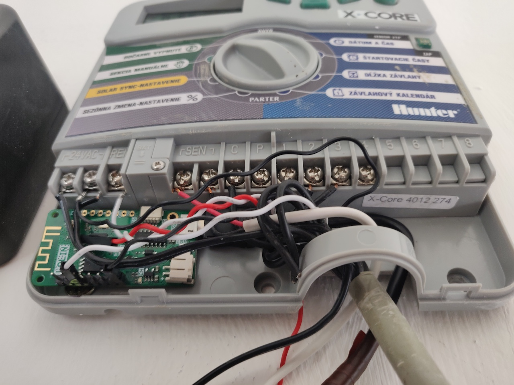
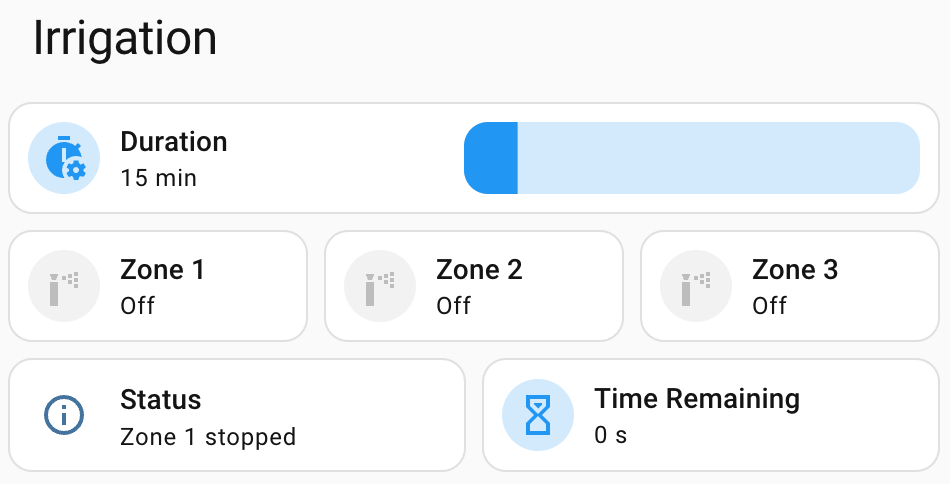

This project integrates the **Hunter X-Core** irrigation controller into Home Assistant using ESPHome.
It acts as a smart WiFi remote, preserving the controller's manual functions and physical dials while
enabling remote control and automations.

## What it does

By connecting an ESP8266 or ESP32 to the controller's REM (Remote) terminal, this integration enables:

- **Remote Control**: Start or stop up to 8 irrigation zones and 4 programs remotely.
- **Real-Time Status**: Exposes zone timers, current running status, and WiFi diagnostics to Home Assistant.
- **Platform Agnostic**: Works with both ESP8266 (e.g., Wemos D1 Mini) and ESP32 boards.
- **Optional MQTT**: Full MQTT support for broker-based setups.

## Pinout & Hardware Setup

Connect your ESP device directly to the Hunter X-Core controller:

| Hunter X-Core | ESP8266 (D1 Mini) | ESP32  |
| ------------- | ----------------- | ------ |
| **REM**       | D0 (GPIO16)       | GPIO18 |
| **GND**       | GND               | GND    |

_(Note: The REM terminal uses a one-wire, write-only data line referenced to AC#2 or GND depending on your
exact hardware setup. Please refer to the [project repository](https://github.com/marek-polak/esphome-hunter-xcore)
for extensive installation and grounding instructions before proceeding.)_

## Basic Configuration

Because this project utilizes custom external components for the Hunter SmartPort protocol and MQTT zone
logic, the easiest way to deploy is by cloning the repository and flashing it directly.

## Configuration Options

When deploying from the repository, configuration is managed via a `secrets.yaml` file (copied from `config.yaml`).
The available options are:

- **`zone_count`** (Important): Set this to match the number of zones your physical Hunter X-Core
  controller supports (e.g., `4`, `6`, or `8`). Any unused zones beyond this count are automatically
  hidden from Home Assistant and rejected by the MQTT logic.
- **WiFi Setup**: `wifi_ssid` and `wifi_password`
- **API Encryption**: `api_encryption_key`
- **MQTT Setup** (Optional): `mqtt_broker`, `mqtt_username`, `mqtt_password`
- **Web Server** (Optional): `web_username`, `web_password`

## Home Assistant Dashboard

Once configured, the zones and countdown timers are available natively in Home Assistant. Here is an example
of a custom Lovelace dashboard:

