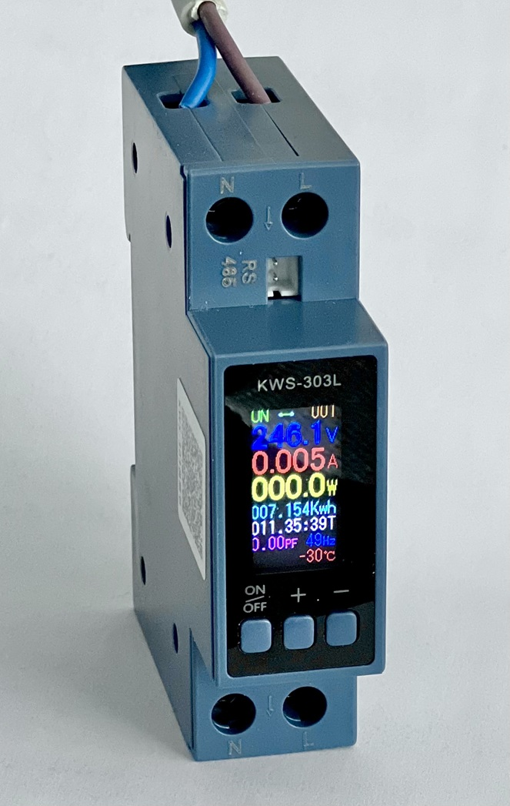
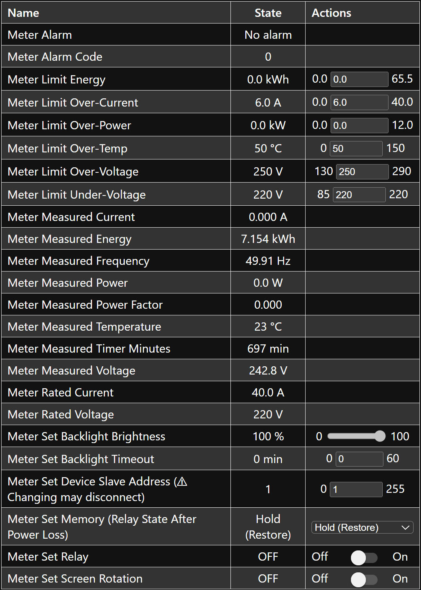

## KWS-303L

Configuration for the KWS-303L Energy Meter – a compact, 1-module DIN-rail, Modbus-based device used for monitoring electrical parameters such as voltage, current (rated at 40 A), power, and more. This configuration enables seamless integration of the KWS-303L into ESPHome-based projects.

## KWS-303L Energy Meter



## KWS-303L Energy Meter in ESPHome



## Features

- **Real-time Monitoring** – Measure voltage, current, power, energy, frequency, and more.
- **Alarm Support** – Detect over-voltage, under-voltage, over-current, and over-temperature conditions.
- **Configurable Limits** – Set thresholds for voltage, current, power, and temperature.
- **Multi-device Support** – Connect multiple meters to the same RS-485 bus.
- **Relay Control** – Control the onboard relay to switch loads on or off.

> **Note:** This is not a protection device. Use it for monitoring purposes only.

## Manufacturer Documentation

For technical specifications, refer to the official user manual (source: http://kowsi.cn/):  
[**KWS-303L User Manual**](kws303.pdf)

> **Important:** The manufacturer does not publish register mappings for this device. This configuration is based on reverse engineering efforts, primarily by [baldale](https://github.com/baldale) – many thanks – and community contributions.

## ESPHome Integration

### Prerequisites

Ensure UART and Modbus are configured in your ESPHome YAML. For example:

```yaml
# Configure the UART interface for RS-485 communication and initialise Modbus.
# This example uses an ESP8266 NodeMCU Devkit v0.9 with a MAX485 module.
uart:
  - id: uart_rs_485
    tx_pin: 14
    rx_pin: 12
    baud_rate: 9600
    parity: "EVEN"
    stop_bits: 1

modbus:
  - id: kws_modbus
    uart_id: uart_rs_485
    flow_control_pin: 13
```

### Using `kws303l.yaml` directly from GitHub repository

```yaml
packages:
  meter1:
    url: https://github.com/BieleckiLtd/KWS-303L-ESPHome
    files:
      - path: kws303l.yaml
        vars:
          modbus_id: kws_modbus
          slave_addr: 1
```

## Known Issues

- Alarms cannot be cleared programmatically.
- Over-power alarm always reports code `0` (no alarm).
- Some alarm codes are undocumented or unclear.
- Energy limit setting is unreliable.
- No known register for changing the display language.
