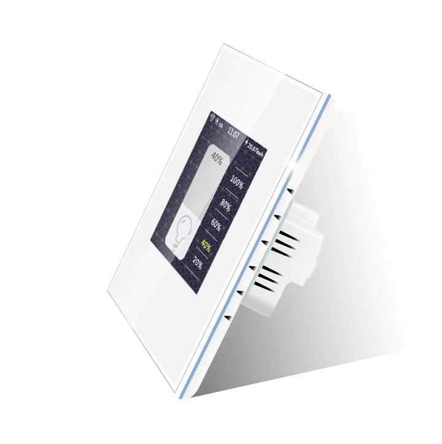

 

## Drivers

* Processor: ESP32-WROVER-B
* Touchscreen: `6336`
* Display: ST7789 (using `ili9xxxx` plaform)

## GPIO Pinout

### SPI (used for display)

| Pin    | Function      |
| ------ | ------------- |
| GPIO19 | clock   |
| GPIO23 | mosi    |
| GPIO25 | miso    |
| GPIO22 | cs      |
| GPIO21 | dc      |
| GPIO18 | reset   |

### I²C (used for touchscreen)

| Pin    | Function      |
| ------ | ------------- |
| GPIO4 | i2c SDA     |
| GPIO0 | i2c SCL     |

### Backlight

| Pin    | Function      |
| ------ | ------------- |
| GPIO5  | backlight   |

### Mood Light

| Pin    | Function      |
| ------ | ------------- |
| GPIO26  | red   |
| GPIO32  | green   |
| GPIO33  | blue   |

### Relay (3-gang switch model)

| Pin    | Function      |
| ------ | ------------- |
| GPIO12  | relay #1   |
| GPIO14  | relay #2   |
| GPIO27  | relay #3   |

### How To Flash

See BlackAdder's instruction on [how to flash custom firmware](https://blakadder.com/lanbon-L8-custom-firmware/).
No soldering required.

### Example Configuration

```yaml
psram:
  mode: octal
  speed: 80MHz

output:
  - platform: ledc
    pin: GPIO5
    id: backlight_pwm
  - platform: ledc
    pin: GPIO26
    id: moodRed
  - platform: ledc
    pin: GPIO32
    id: moodGreen
  - platform: ledc
    pin: GPIO33
    id: moodBlue
  - platform: gpio
    pin: GPIO12
    id: relay_1
  - platform: gpio
    pin: GPIO14
    id: relay_2
  - platform: gpio
    pin: GPIO27
    id: relay_3

light:
  - platform: rgb
    name: "Mood Light"
    red: moodRed
    green: moodGreen
    blue: moodBlue
  - platform: monochromatic
    name: "Backlight"
    id: backlight
    output: backlight_pwm
    restore_mode: ALWAYS_ON

spi:
  clk_pin: GPIO19
  mosi_pin: GPIO23
  miso_pin: GPIO25

i2c:
  sda: GPIO4
  scl: GPIO0

display:
  - id: langbon_L8
    platform: ili9xxx
    model: ST7789V
    invert_colors: false
    dimensions: 240x320
    cs_pin: GPIO22
    dc_pin: GPIO21
    reset_pin: GPIO18
    auto_clear_enabled: false
    update_interval: never
    rotation: 180

touchscreen:
  platform: ft63x6
  calibration:
    x_min: 0
    y_min: 0
    x_max: 230
    y_max: 312
  on_release:
    - if:
        condition: lvgl.is_paused
        then:
          - lvgl.resume:
          - lvgl.widget.redraw:
          - light.turn_on: backlight

lvgl:
  on_idle:
    timeout: !lambda "return 10000;"
    then:
      - light.turn_off: backlight
      - lvgl.pause:
  pages:
     ...
```
