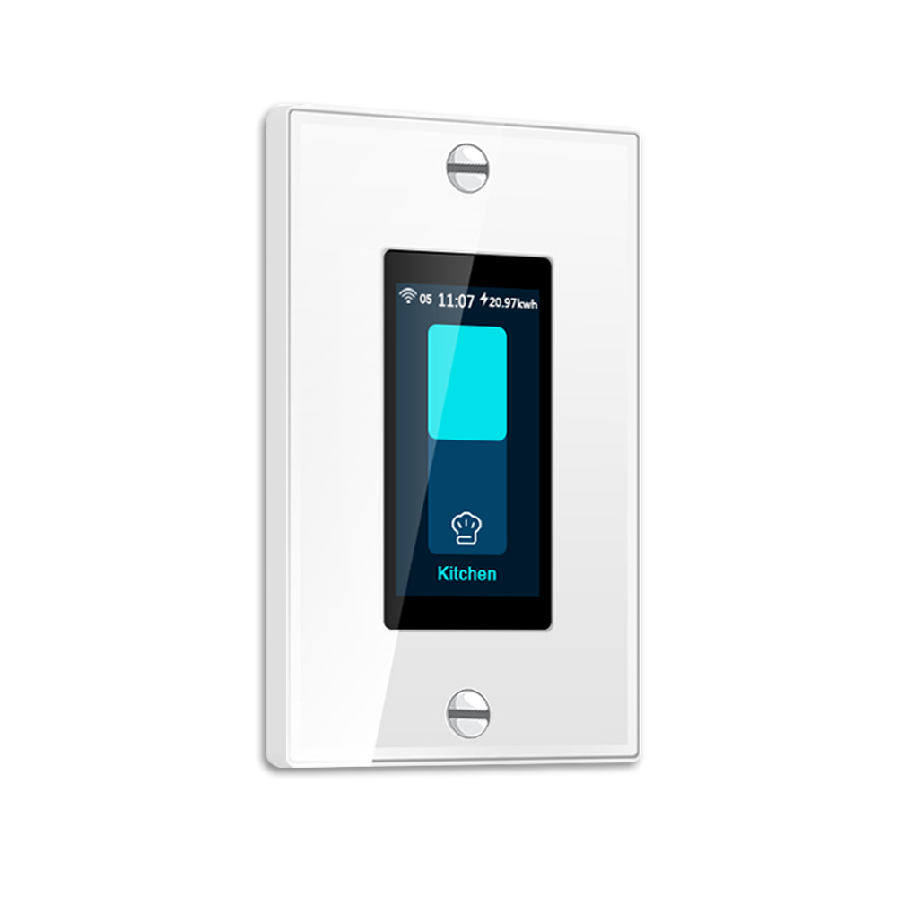
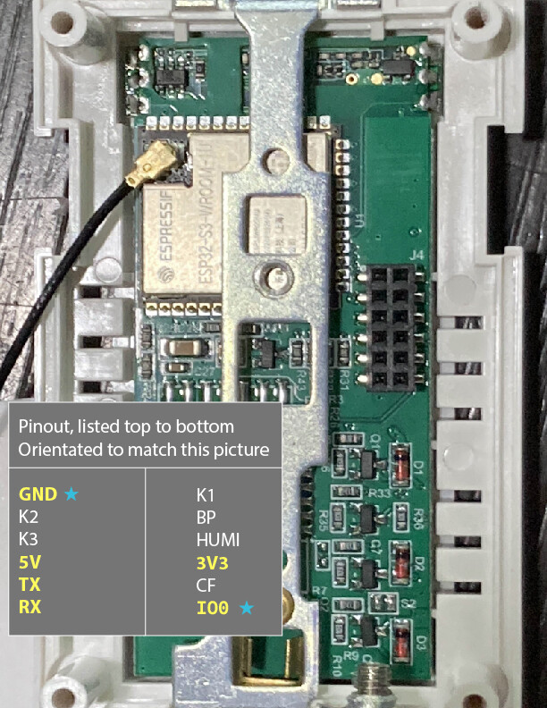

## Drivers

* Processor: ESP32-S3-Wroom-1U
* Touchscreen: `6336`
* Display: ST7789V2 (using `ili9xxxx` plaform)

## GPIO Pinout

### i80 (used for display)

| Pin    | Function      |
| ------ | ------------- |
| GPIO13 | WR   |
| GPIO18 | RD   |
| GPIO6 | data[0]    |
| GPIO7 | data[1]    |
| GPIO15 | data[2]    |
| GPIO16 | data[3]    |
| GPIO10 | data[4]    |
| GPIO9 | data[5]    |
| GPIO46 | data[6]    |
| GPIO3 | data[7]    |
| GPIO21 | cs      |
| GPIO17 | dc      |
| GPIO4 | reset   |

### I²C (used for touchscreen)

| Pin    | Function      |
| ------ | ------------- |
| GPI035 | i2c SDA     |
| GPIO0 | i2c SCL     |

### Backlight

| Pin    | Function      |
| ------ | ------------- |
| GPI42  | backlight   |

### Relay

| Pin    | Function      |
| ------ | ------------- |
| GPIO36 | relay   |

### How To Flash

See BlackAdder's instruction on [how to flash custom firmware for the L8](https://blakadder.com/lanbon-L8-custom-firmware/), referring to the following diagram for the L9 connector pinout.
No soldering required.
IMPORTANT: Both 5v and 3.3v must be supplied.



### Example Configuration

```yaml
psram:
  speed: 80MHz

output:
  - platform: ledc
    pin: GPIO42
    id: backlight_pwm
  - platform: gpio
    pin: GPIO36
    id: relay

light:
  - platform: monochromatic
    name: "Backlight"
    id: backlight
    output: backlight_pwm
    restore_mode: ALWAYS_ON
  - platform: binary
    id: local_light
    name: "Light"
    output: relay

power_supply:
  - id: 'i80_rd_pin'
    pin:
      number: 18
      inverted: true

spi:
  type: octal
  clk_pin: GPIO13  # WR pin
  data_pins:
    - GPIO6
    - GPIO7
    - GPIO15
    - GPIO16
    - GPIO10
    - GPIO9
    - ignore_strapping_warning: true
      number: GPIO46
    - ignore_strapping_warning: true
      number: GPIO3

i2c:
  sda: GPIO35
  scl:
    ignore_strapping_warning: true
    number: GPIO0

display:
  - id: langbon_L9
    platform: mipi_spi
    model: CUSTOM
    invert_colors: true
    dimensions:
      height: 320
      width: 170
      offset_width: 35
    bus_mode: octal
    dc_pin: GPIO17
    cs_pin: GPIO21
    reset_pin: GPIO4
    auto_clear_enabled: false
    update_interval: never
    rotation: 0

touchscreen:
  platform: ft63x6
  calibration:
    x_min: 0
    y_min: 3
    x_max: 169
    y_max: 319
  on_release:
    - if:
        condition: lvgl.is_paused
        then:
          - lvgl.resume:
          - lvgl.widget.redraw:
          - light.turn_on: backlight

lvgl:
  on_idle:
    timeout: !lambda "return 10000;"
    then:
      - light.turn_off: backlight
      - lvgl.pause:
  pages:
     ...
```
