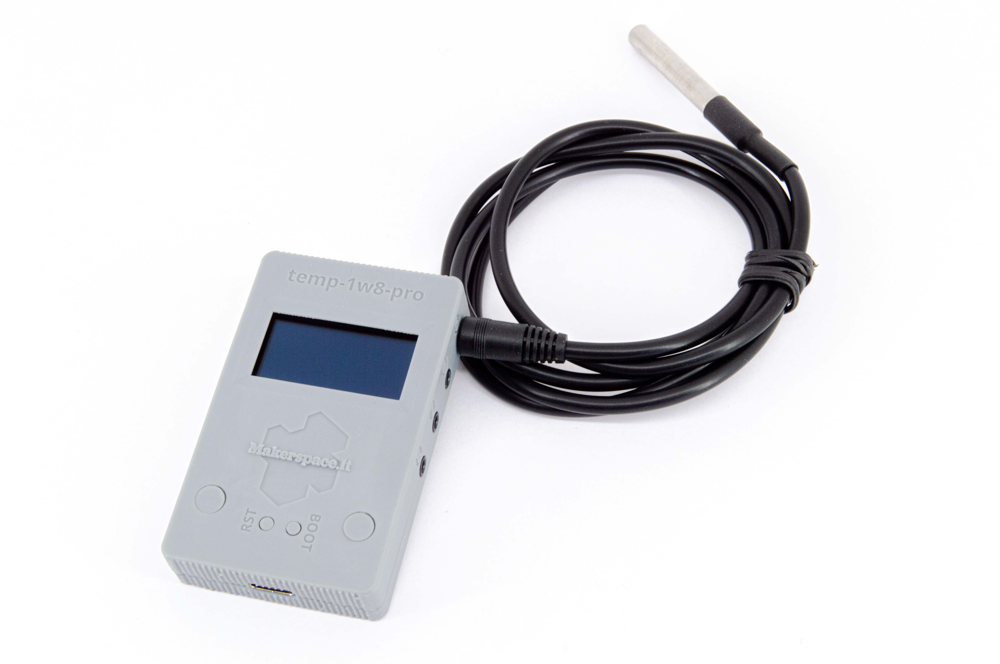
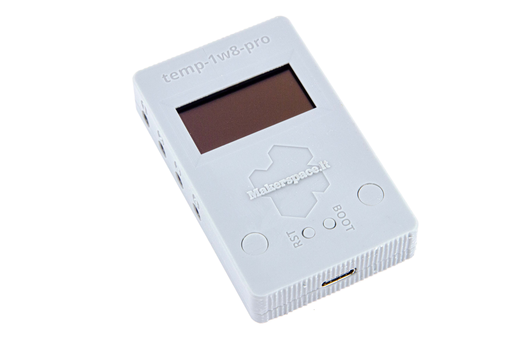
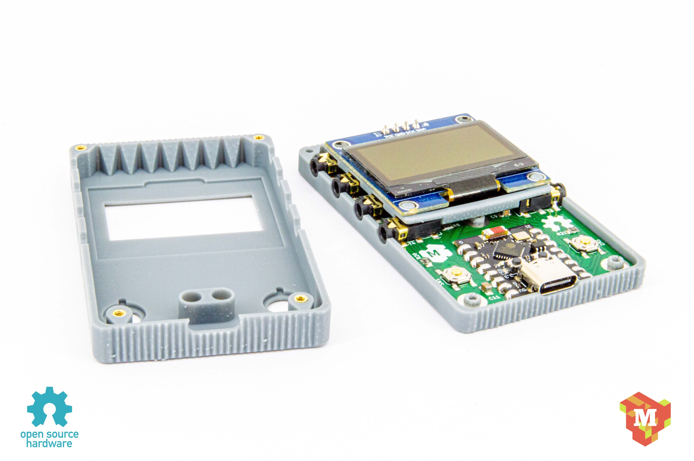
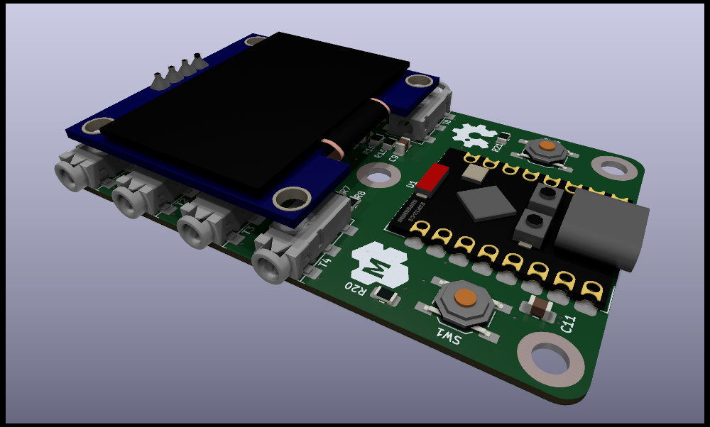

## temp-1w8-pro: measure temperature with up 8 sensors

This device is specifically designed for temperature monitoring with up to 8 thermometers.

Key features:

- 8x 1-wire interfaces for DS18B20 Dallas temperature sensors using 2.5mm 4p audio jack connectors (available out-of-the-box on most e-commerce>
- 2x general-purpose, user programmable buttons
- 128x64 OLED display
- Powered via USB-C
- Compatibility with ESPHome and HomeAssistant
- Comes pre-flashed and ready to use without any additional configuration
- YAML configuration file is available for easy configuration
- OSHWA certified

## Project pages

- [Tindie](https://temp-1w8-pro.makerspace.lt/shop)
- [GitHub](https://temp-1w8-pro.makerspace.lt)
- [OSHWA](https://certification.oshwa.org/lt000004.html)
