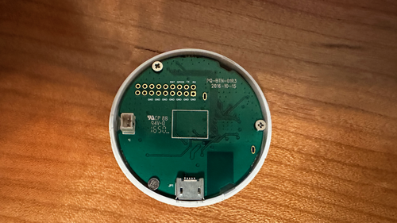
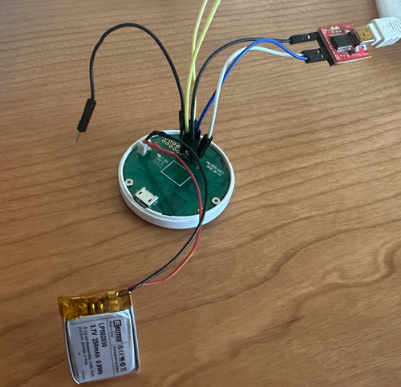

## General Notes

The [myStrom WiFi Button](https://mystrom.ch/wifi-button/) is controlled by ESP8266EX.

The board exposes a header with all needed connections:


You can solder the wires for the initial flash, but it's not required. I've had success just inserting breadboard pins into the header:


Use board `esp_wroom_02` even though this is not a wroom chip. It will allow full use of the button's 2MB flash.

It is designed to be in deep sleep most of the time. It has a very small battery. It won't last very long if it is always running. Pressing the button wakes it up from deep sleep. The best way to use this is with an on_boot trigger at priority 225 - that way wifi is up and you can do an http request or something similar, then go back to sleep.
NOTE - If you are using deep sleep, with the button to wake, the first time you press the button it works, but the next sleep is immediately woken up. This is because this device has a few capacitors initially holding the reset high, and the button discharges them. GPIO4 needs to be set high to recharge them, otherwise it thinks the button is still pressed and immediately wakes.


## Initial Install

To open the case and do the initial ESPHome flash:

1. Remove the outer silicone band
1. Split the case apart with a flat screwdriver on the left side while looking at the lightbulb logo.
    - WARNING - the tabs holding the halves together can break off. However, if they do it's ok - the silicone band will hold them together well enough on its own.
1. Unplug the battery.
1. Using a 3.3v FTDI programmer, connect the pins.
    - Only connect GND, RX, TX. Power will come from the battery.
1. Connect GPIO 0 to GND.
1. Put a wire in RST but don't connect the other end yet.
1. Connect the programmer USB to the ESPHome system
1. Attach the battery.
1. Momentarily touch the other end of the RST wire to one of the GND pins to reset the esp.
    - Sometimes it works without resetting, but sometimes not. I've found it works every time if you do a reset.
1. Flash via USB

## Subsequent Installs

Flashing over wifi fails if the device is sleeping. To overcome this, press the button to wake at the right time so it is still awake once it gets to the upload step. It may take a few retries to get the timing right.

## GPIO Pinout

| Pin    | Function                                                |
| ------ | ------------------------------------------------------- |
| GPIO5  | White LED - Low on                                      |
| GPIO13 | Green LED - Low on                                      |
| GPIO14 | Red LED - Low on                                        |
| GPIO4  | Must be set High if using button to wake from deep sleep|

## Basic Configuration

This configuration is set up to call an http request on boot, then go to sleep.
Before/during connection the led pulses white
If successful request, it lights the green led. If unsuccessful, it flashes the red led.


```yaml
esphome:
  name: button
  friendly_name: button
  on_boot:
  - priority: 550
    then:
      - light.turn_on:
          id: white_light
          effect: "Connecting"
  - priority: 225.0
    then:
      - output.turn_on: cap_charge
      - http_request.get: 
          url: http://url.to.my.http/api/
          on_response:
            then:
              - if:
                  condition:
                    lambda: 'return status_code == 200;'
                  then:
                    - light.turn_off:
                        id: white_light
                    - light.turn_on:
                        id: green_light
                    - delay: 2s
                    - deep_sleep.enter:
                        id: deep_sleep_forever
                  else:
                    - light.turn_off:
                        id: white_light
                    - light.turn_on:
                        id: red_light
                        effect: "Error"
                    - delay: 2s
                    - deep_sleep.enter:
                        id: deep_sleep_forever
                        
deep_sleep:
  id: deep_sleep_forever
  run_duration: 20s #This is ignored when the deep_sleep.enter is called above
  # not setting a sleep duration means sleep forever

http_request:
  useragent: esphome/device
  timeout: 10s

esp8266:
  board: esp_wroom_02

# Enable logging
logger:

# Enable Home Assistant API
api:
  encryption:
    key: "***"

ota:
  password: "***"

wifi:
  ssid: !secret wifi_ssid
  password: !secret wifi_password

  # Enable fallback hotspot (captive portal) in case wifi connection fails
  ap:
    ssid: "Button Fallback Hotspot"
    password: "****"

captive_portal:

output:
  - platform: esp8266_pwm
    pin: GPIO5
    id: pwm_white
    inverted: true
  - platform: esp8266_pwm
    pin: GPIO13
    id: pwm_green
    inverted: true
  - platform: esp8266_pwm
    pin: GPIO14
    id: pwm_red
    inverted: true
  - platform: gpio
    id: cap_charge
    pin: GPIO4

light:
  - platform: monochromatic
    id: white_light
    output: pwm_white
    name: "White LED"
    effects:
      - pulse:
          name: "Connecting"
          transition_length: 0.5s
          update_interval: 0.5s
          min_brightness: 10%
          max_brightness: 60%
  - platform: monochromatic
    id: green_light
    output: pwm_green
    name: "Green LED"
  - platform: monochromatic
    id: red_light
    output: pwm_red
    name: "Red LED"
    effects:
      - pulse:
          name: "Error"
          transition_length: 0.2s
          update_interval: 0.2s
          min_brightness: 0%
          max_brightness: 100%
```
