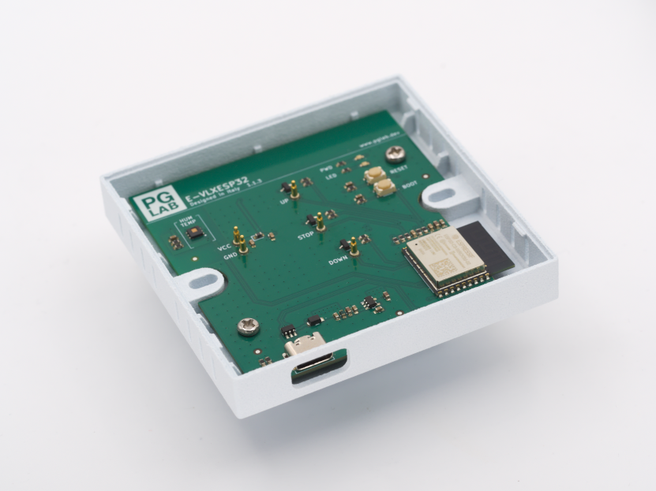
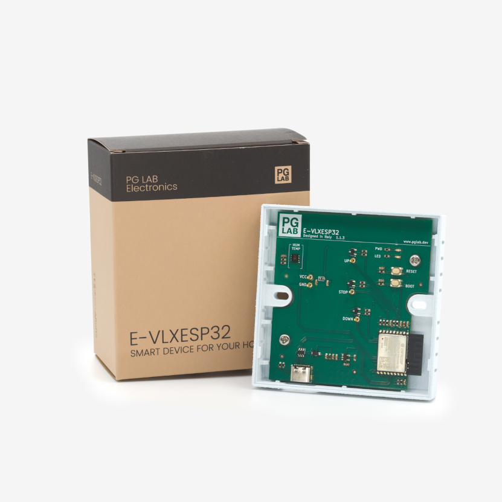
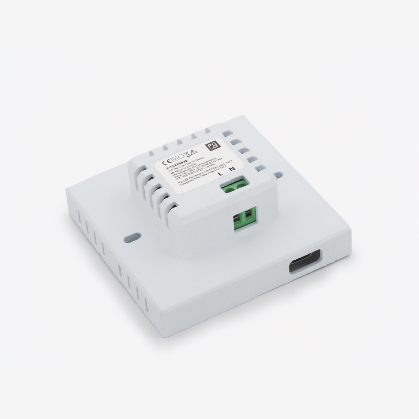
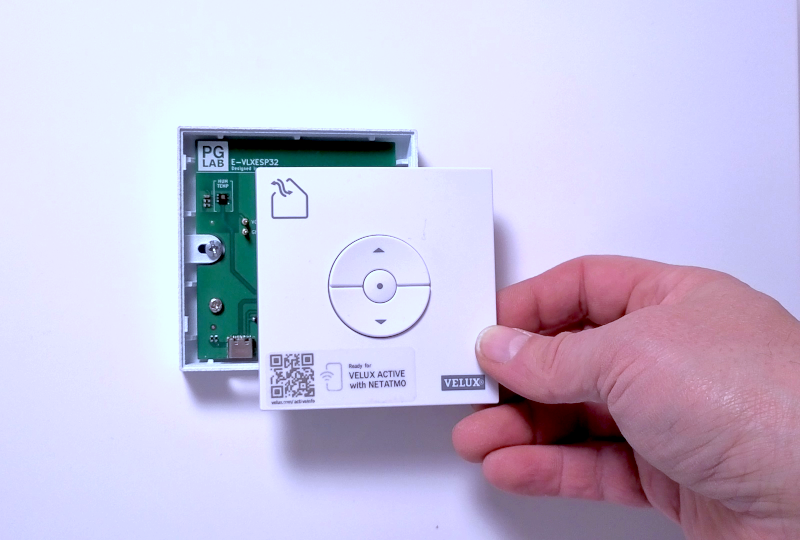

## Device Information

Model Reference: PGEVLXESP32AC1

Manufacturer: [PG LAB Electronics](https://www.pglab.dev/)

## Overview

The **E-VLXESP32** is a compact ESP32-based module with an integrated temperature and humidity sensor.
It is designed to interface with battery-powered VELUX® wall remote controls,
enabling smart automation and remote operation of motorized skylight windows.
The module electrically interfaces with the wall remote via pogo pins,
enabling it to emulate button presses via software control.

The device ships pre-flashed with ESPHome firmware and can be adopted directly from the ESPHome dashboard
or provisioned via BLE using [Improv standard](https://www.improv-wifi.com/) for configuring Wi-Fi credentials.
It is mains-powered (220V AC) and designed for permanent wall installation.

The **E-VLXESP32** is available at [pglab.dev](https://www.pglab.dev/shop/p/e-vlxesp32).

## Features

- Wi-Fi control of VELUX® wall remotes
- Full control of window operations (open, close, stop)
- Integrated temperature and humidity sensing
- Snap-fit installation (no soldering required)
- No batteries required
- Compatible with standard 501 wall boxes
- CE and RoHS certified

## Hardware

| Component        | Description                              |
|------------------|------------------------------------------|
| MCU              | ESP32-C3 (ESP32-C3-WROOM-02-N4)          |
| Sensor           | HDC1080 (temperature & humidity)         |
| Interface        | Pogo pins for KLI311, KLI312, KLI313     |
| Programming Port | USB-C                                    |
| Power Module     | IRM-01-5 AC-DC                           |
| Power Input      | 220V AC, 50/60 Hz (screw terminal)       |
| Enclosure        | MJF 3D printed, Nylon PA12 (white)       |

## Installation

Installation guide is available [here](https://pglab-electronics.github.io/docs/evlxesp32/evlxesp32/).

⚠️ **This product must be installed by qualified personnel. Incorrect installation may result in
equipment damage, electric shock, or personal injury.
The manufacturer assumes no liability for improper use or installation.**

## Getting Started

⚠️ **Ensure mains power is disconnected before installation.**

1. Turn off the circuit breaker.
2. Install the device into the 501 wall box.
3. Snap-fit the VELUX® wall remote cover (KLI311, KLI312, KLI313).
4. Restore power at the circuit breaker.
5. Connect to the **E-VLXESP32** hotspot and select your Wi-Fi network.
6. Adopt the device in Home Assistant via the ESPHome integration.

## Links

- [Shop](https://www.pglab.dev)
- [GitHub Repository](https://github.com/pglab-electronics/e-vlxesp32)
- [Installation Guide](https://pglab-electronics.github.io/docs/evlxesp32/evlxesp32/)

## Product Images

| Box                                    | Back view                        | Wall installed                         |
|----------------------------------------|----------------------------------|----------------------------------------|
|  |  |  |

## Configuration

```yaml url=https://github.com/pglab-electronics/e-vlxesp32/blob/main/evlxesp32.yaml
```

## Disclaimers

The E-VLXESP32 is an independent third-party product developed and manufactured by PG LAB Electronics S.R.L.S.
It is not affiliated with, endorsed by, or sponsored by VELUX A/S or its affiliates.

VELUX® is a registered trademark of its respective owner. References to VELUX® products are provided solely
to indicate compatibility.

Compatibility is limited to the following remote control models: KLI311, KLI312, KLI313. Compatibility with
other devices or future revisions is not guaranteed.
