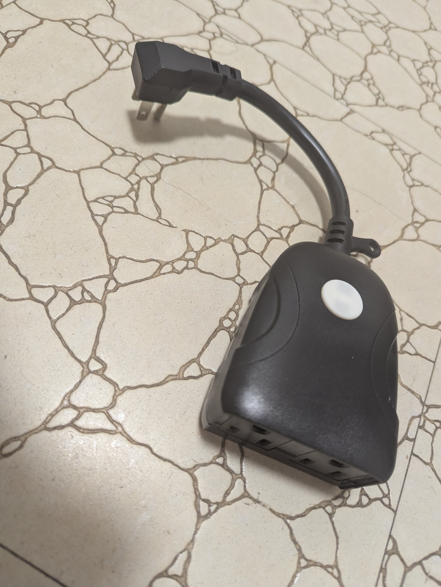
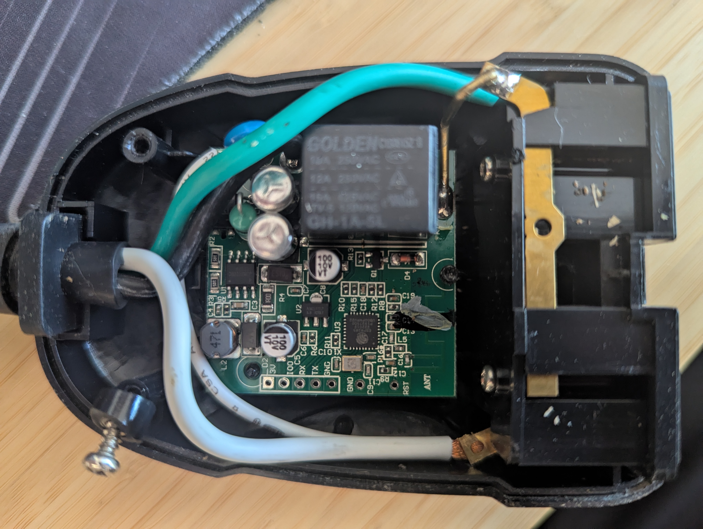

This smart plug has two outlets controlled by the same relay. The relay is toggled via a button. The blue LED indicates network connectivity, while the red LED shows the relay state.  
The device was purchased at Costco CA.

Model: CCRCWFIO2PK
ITM. / ART. No 1221313
FCC ID: 2AMV5-SK509-W-1
Date Code: 08/19

125V AC 60 Hz
15A / 1875W Resistive, 8A / 1000W Tungsten

CHIP: EPS8285

## Getting it up and running
### USB Serial Converter
The device must be disassembled to access the UART contacts. There are three screws: two are visible, and the third is under the sticker in the middle on the opposite side. Once the screws are removed, the lid can be easily taken off.  

| Pin    | Connection           |
| ------ | -------------------- |
| 3V     | Connect to 3.3V      |
| IO0    | Connect to any GND   |
| RX     | Connect to TX        |
| TX     | Connect to RX        |
| GND1   |                      |
| ....   | ...                  |
| GND1   |                      |
| ....   | ...                  |
| RST    |                      |

Connect IO0 to GND to enter boot mode. To restart the device before entering boot mode, either reconnect GND or momentarily connect RST to GND. It is possible to flash the device without soldering the pins, but it may be a bit tricky.

## GPIO Pinout

| Pin    | Function             |
| ------ | -------------------- |
| GPIO04 | Blue LED             |
| GPIO05 | Red LED              |
| GPIO12 | Relay                |
| GPIO13 | Button               |


## Basic Configuration

The following configuration mimics the original behavior: pressing the `Button` toggles the `Relay`. The `Blue LED` indicates status, and the `Red LED` turns on when the `Relay` is on.

```yaml
substitutions:
  name: ccrwfio2pk

esphome:
  name: "${name}"
  friendly_name: "${name}"

esp8266:
  board: esp8285

logger:
  
ota:
  - platform: esphome
    password: !secret ota_password

wifi:
  ssid: !secret wifi_ssid
  password: !secret wifi_password

  ap:
    ssid: "${name} Fallback Hotspot"
    password: !secret ap_password

captive_portal:

web_server:
  version: 3

status_led:
  pin:
    number: GPIO4
    inverted: True

switch:
  - platform: gpio
    id: relay
    name: "Relay"
    pin:
      number: GPIO12
    on_turn_on:
      - output.turn_on: red_led
    on_turn_off:
      - output.turn_off: red_led      

output:
  - platform: gpio
    id: red_led
    pin:
      number: GPIO5
      inverted: true      

binary_sensor:
  - platform: gpio
    name: "Button"
    pin:
      number: GPIO13
      mode: INPUT_PULLUP
      inverted: true
    on_press:
      then:
        - switch.toggle: relay 
```
