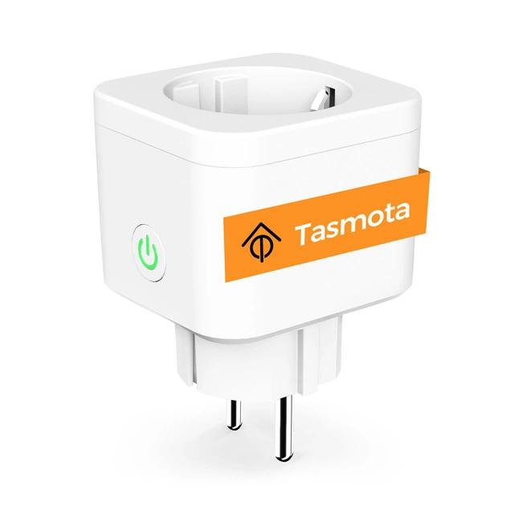

## GPIO Pinout

| Pin    | Function                    |
| ------ | --------------------------- |
| GPIO00 | None                        |
| GPIO01 | None                        |
| GPIO02 | None                        |
| GPIO03 | CSE7766 Rx                  |
| GPIO04 | LedLinki                    |
| GPIO05 | Button 1                    |
| GPIO09 | None                        |
| GPIO10 | None                        |
| GPIO12 | Led_i 1                     |
| GPIO13 | Relay 1                     |
| GPIO14 | None                        |
| GPIO15 | None                        |
| GPIO16 | None                        |
| GPIO17 | ADC Temp                    |

## Configuration as relay with overpower and overtemperature protection

This is the original device documentation page when it is flashed with Tasmota: https://templates.blakadder.com/refoss_P11.html
For accurate energy consumption measurements this device requires power monitoring calibration.

```yaml

substitutions:
  devicename: "refossp11plug1"
  friendly_name: Refoss P11 Plug 1
  device_description: Refoss P11 Power Monitoring Plug with button and RGB led.

esphome:
  name: ${devicename}
  comment: ${device_description}
  platform: esp8266
  board: esp01_1m

# Enable logging
logger:
  baud_rate: 0

# Enable Home Assistant API
api:
  encryption:
    key: !secret p11smartplug1_api_key

ota:
  password: !secret p11smartplug1_ota_password

wifi:
  ssid: !secret wifi_ssid
  password: !secret wifi_password

  # Enable fallback hotspot (captive portal) in case wifi connection fails
  ap:
    ssid: !secret p11smartplug1_ap_ssid
    password: !secret p11smartplug1_ap_password

captive_portal:
    
web_server:
  port: 80

# Time used for daily KWh usage  
time:
  - platform: homeassistant
    id: homeassistant_time

status_led:
  pin:
    number: GPIO4
    inverted: yes

binary_sensor:
  # Button 1 configuration
  - id: button_1
    platform: gpio
    pin:
      number: GPIO05
    on_press:
      then:
        - switch.toggle: relay_1
# Uncomment and test if you would like your device to reset on long press
#    on_click:
#      min_length: 5000ms
#      max_length: 10000ms
#      then:
#        - switch.turn_on: reset
  - platform: status
    name: "${friendly_name} Status"
    
text_sensor:
# Reports the ESPHome Version with compile date
  - platform: version
    name: ${friendly_name} ESPHome Version


switch:
  # Set relays as switches
  - id: relay_1
    platform: gpio
    pin: GPIO13
    icon: mdi:power-socket-fr
    name: "${friendly_name} Switch"
  # Edit below line based on what default behaviour you want after power outage
    restore_mode: RESTORE_DEFAULT_ON
    on_turn_on:
      - switch.turn_on: sw_led1
    on_turn_off:
      - switch.turn_off: sw_led1
  # Register LED on GPIO
  - id: sw_led1
    platform: gpio
    pin: 
      number: GPIO12
      inverted: yes
#  - platform: restart
#    name: "${friendly_name} Restart"
#    id: reset

uart:
  id: cse7766_uart_bus
  rx_pin: GPIO03
  baud_rate: 4800

sensor:
  - platform: cse7766 # https://esphome.io/components/sensor/cse7766.html
    update_interval: 1s
    uart_id: cse7766_uart_bus
    current:
      name: "${friendly_name} Current"
      unit_of_measurement: A
      accuracy_decimals: 3
      id: "${devicename}Current"
    energy:
      name: "${friendly_name} Energy"
      id: "${devicename}Energy"
      unit_of_measurement: Wh
    power:
      name: "${friendly_name} Power"
      id: "${devicename}Power"
      unit_of_measurement: W
      filters:
      - calibrate_linear:
        - 0.0 -> 1.0
        - 51.0 -> 97.0
    voltage:
      name: "${friendly_name} Voltage"
      unit_of_measurement: V
      id: "${devicename}Voltage"
# Uncomment and calibrate based on your device measurements
#      filters:
#      - calibrate_linear:
#        - 0.0 -> 0.0
#        - 127.0 -> 242.0
    
    

  - platform: total_daily_energy
    name: "${friendly_name} Total Daily Energy"
    power_id: "${devicename}Power"
    filters:
        # Multiplication factor from W to kW is 0.001
        - multiply: 0.001
    unit_of_measurement: kWh
    icon: mdi:clock-alert

  - platform: uptime
    name: "${friendly_name} Uptime"
    icon: mdi:clock-outline
    filters:
      - lambda: return x / 60.0;
    unit_of_measurement: minutes

  - platform: wifi_signal
    name: "${friendly_name} Wifi Signal"
    update_interval: 60s


  - platform: adc
    name: ${friendly_name} Temperature
    unit_of_measurement: "°C"
    accuracy_decimals: 1
    icon: "mdi:thermometer"
    id: temp_analog_reading
    pin: GPIO17
# Uncomment and calibrate based on your device measurements
#    filters:
#      - calibrate_linear:
#        - 0.15 -> 18.6
#        - 0.16 -> 19.8
```
