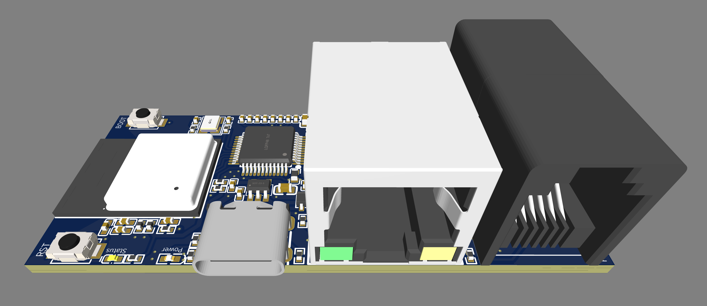

## Description

SlimmeLezer Pro, an ESP32C3 based device to read out the P1 port of a Smart Meter and send data via ethernet or wifi to Home Assistant. It has an P1 passthrough port to connect another P1 device.

## Basic Configuration

The full yaml code for ethernet can be found at
[https://github.com/zuidwijk/SlimmeLezer/blob/main/Pro/config-ethernet.yaml](https://github.com/zuidwijk/SlimmeLezer/blob/main/Pro/config-ethernet.yaml)
