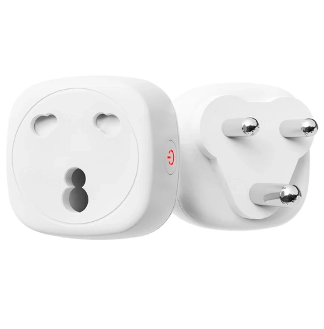

Maker: https://smartpad.co.za/
Product page: https://store.smartpad.co.za/index.php/product/tasmota-16a-smart-plugs-with-energy-monitoring/

Available pre-flashed with ESPHome or Tasmota.

## GPIO Pinout

| Pin    | Function   |
| ------ | ---------- |
| GPIO1  | Status LED |
| GPIO20 | Button     |
| GPIO4  | Relay      |
| GPIO7  | BL0937 CF  |
| GPIO3  | BL0937 CF1 |
| GPIO5  | BL0937 SEL |
| GPIO6  | Relay Led  |

## Basic Configuration

The [Latest configuration](https://github.com/Smartpadza/Device_Configs/blob/main/smartpad-em32-smart-plug.yaml)
can be found on Smartpad South Africas GitHub repo.
