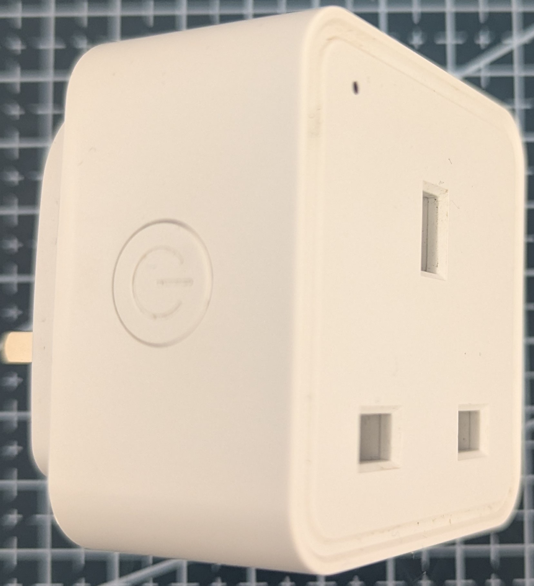
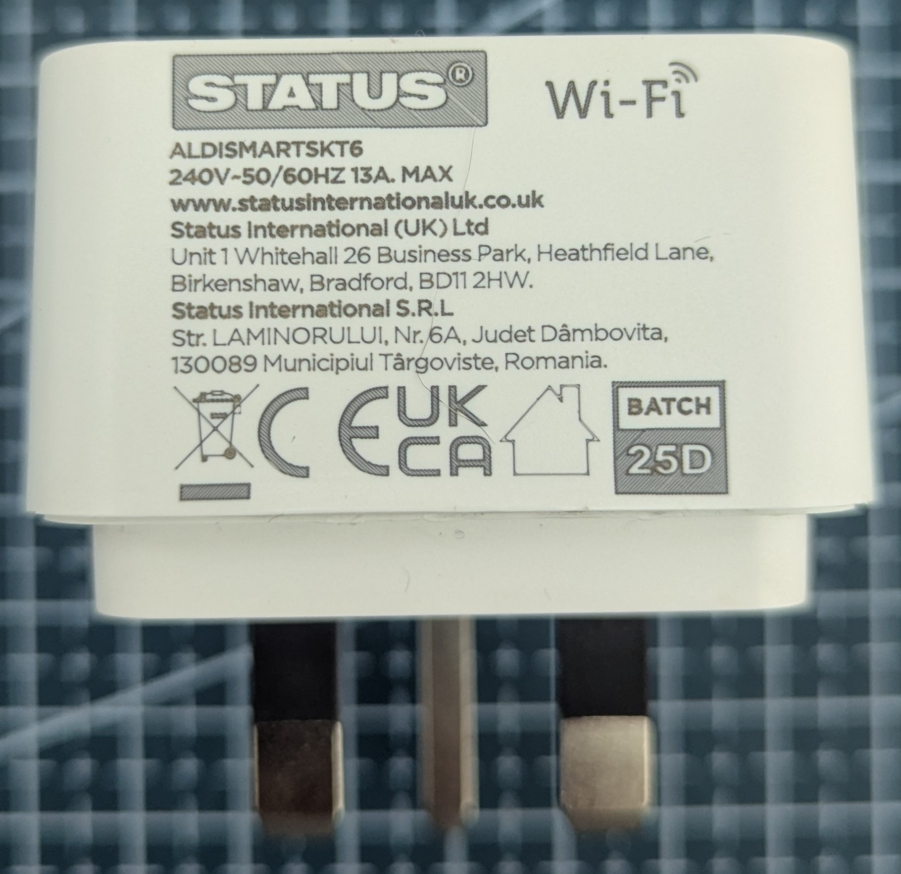
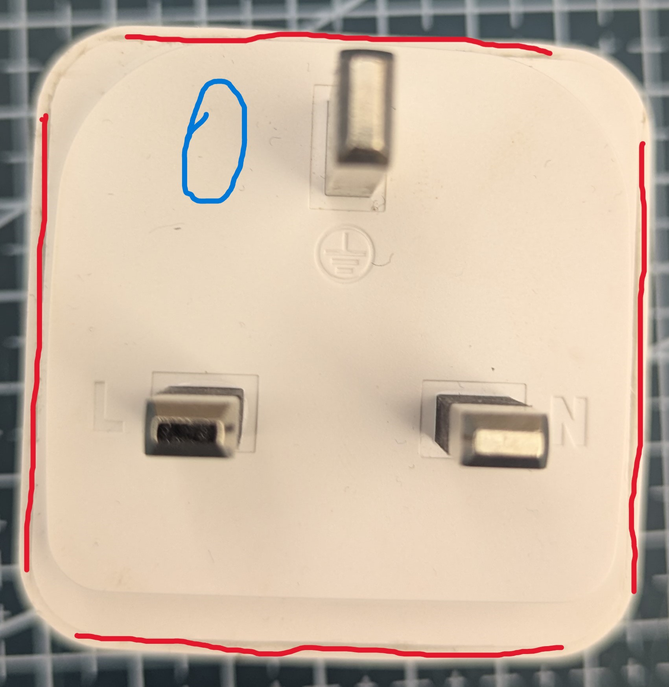
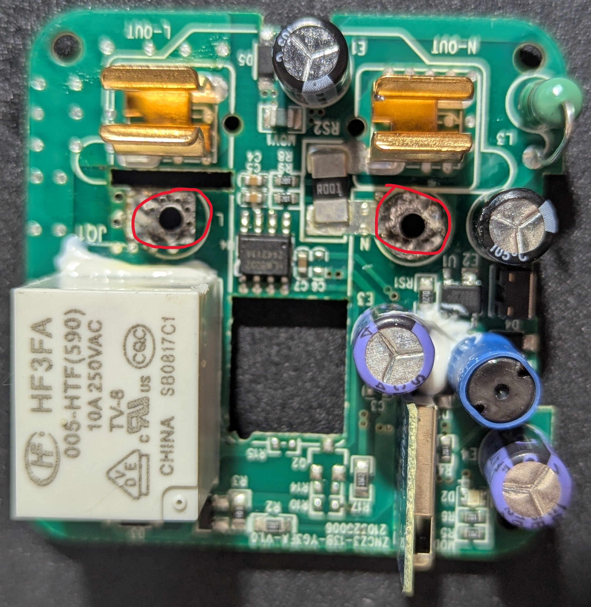
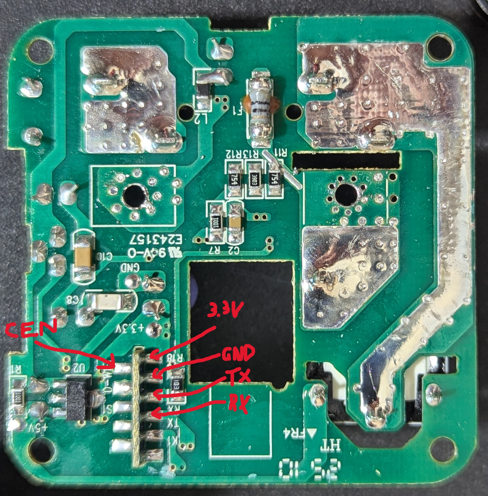

# Status Wifi Plug with Power Monitor

<!-- Describe the device here. See the front-matter table on the contributing page for valid options. -->


These are Tuya manufactured devices branded by Status International (UK) LTD. and sold by Aldi UK. The model number is ALDISMARTSKT6

https://statussmart.com/

It has the HLW8032 power monitor ic and relay control.



**Note:** This model has been patched and tuya cloudcutter does not work.



There are two options to get it flashed. 

Option 1: Carefully drill/cut a single larger hole or a series of smaller holes to create a hole/slot at the blue circle indicated to expose the CB2S modules pads to reprogram the CB2S module. Extreme care should be taken not to drill into the board when making a hole.

Option 2: Carefully use a flat bladed item along the red lines to carefully break the ultrasonic welds in the case without deforming
the outside of the case too much so that you can glue it shut again.

**WARNING - if you do open the case, remember these devices have no isolation between the mains and low voltage side.
NEVER connect anything to the device while connected to the mains supply.**




To remove the board you need to desolder the board from the plug pins and connect the USB to RS232-TTL module that is 3.3V as shown.
To put the CB2S module into boot mode for flashing, the CEN pin needs to be pulled to ground on power-up of the CB2S module using the 3.3v supply from the USB to RS232 converter to be flashed with ESPhome. **DO NOT PLUG INTO WALL SOCKET FOR FLASHING**


# GPIO Pinout
| Pin | Function (CB2S Module) |
| --- | ---------------- |
| P6  | Red LED          |
| P7  | Blue LED         |
| P8  | Button           |
| P10 | UART RX to HLW8032 power monitor IC           |
| P24 | Relay            |

## Basic Configuration

```yaml
substitutions:
  device_name: "status-plug-01"
  friendly_name: "Status Plug 01"
  main_icon: "power-socket-uk"
  # Default Relay State
  # Aka: `restore_mode` in documentation
  # Options: `RESTORE_DEFAULT_OFF`, `RESTORE_DEFAULT_ON`, `ALWAYS_ON`, ALWAYS_OFF`
  default_state: "RESTORE_DEFAULT_OFF"

esphome:
  name: "${device_name}"
  friendly_name: "${friendly_name}"

bk72xx:
  board: CB2S

logger:

api:
  encryption:
    key: !secret api_encryption_key

ota:
  - platform: esphome
    password: !secret ota_password

wifi:
  ssid: !secret wifi_ssid
  password: !secret wifi_password

  # Enable fallback hotspot (captive portal) in case wifi connection fails
  ap:
    ssid: "${device_name}"
    password: !secret ap_password

captive_portal:

time:
  - platform: sntp
    id: sntp_time

text_sensor:
  - platform: libretiny
    version:
      name: LibreTiny Version

binary_sensor:
  - platform: gpio
    id: binary_switch_1
    pin:
      number: P8
      inverted: true
      mode: INPUT_PULLUP
    on_press:
      then:
        - switch.toggle: switch_1

switch:
  - platform: gpio
    name: "${friendly_name}"
    icon: "mdi:${main_icon}"
    id: switch_1
    restore_mode: "${default_state}"
    pin: P24
    on_turn_on:
      - light.turn_on:
          id: led
          brightness: 100%
          transition_length: 0s
    on_turn_off:
      - light.turn_off:
          id: led
          transition_length: 0s

output:
  - platform: libretiny_pwm
    id: state_led
    pin:
      number: P6
      inverted: true

light:
  - platform: monochromatic
    output: state_led
    id: led

status_led:
  pin:
    number: P7
    inverted: true

uart:
  rx_pin: GPIO10
  baud_rate: 4800
  parity: EVEN

sensor:
  - platform: hlw8032
    voltage_divider: 1.88
    voltage:
      name: HLW8032 Voltage
      id: hlw8032_voltage
    current:
      name: HLW8032 Current
      id: hlw8032_current
    power:
      name: HLW8032 Power
      id: hlw8032_power
    apparent_power:
      name: HLW8032 Apparent Power
      id: hlw8032_apparent_power
    power_factor:
      name: HLW8032 Power Factor
      id: hlw8032_power_factor
  - platform: total_daily_energy
    name: Daily Energy
    power_id: hlw8032_power
```
