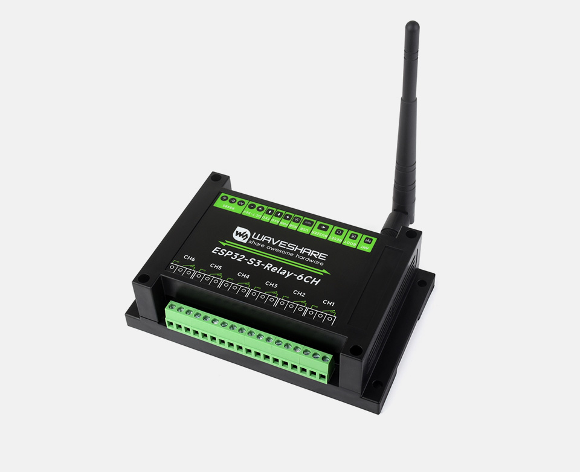
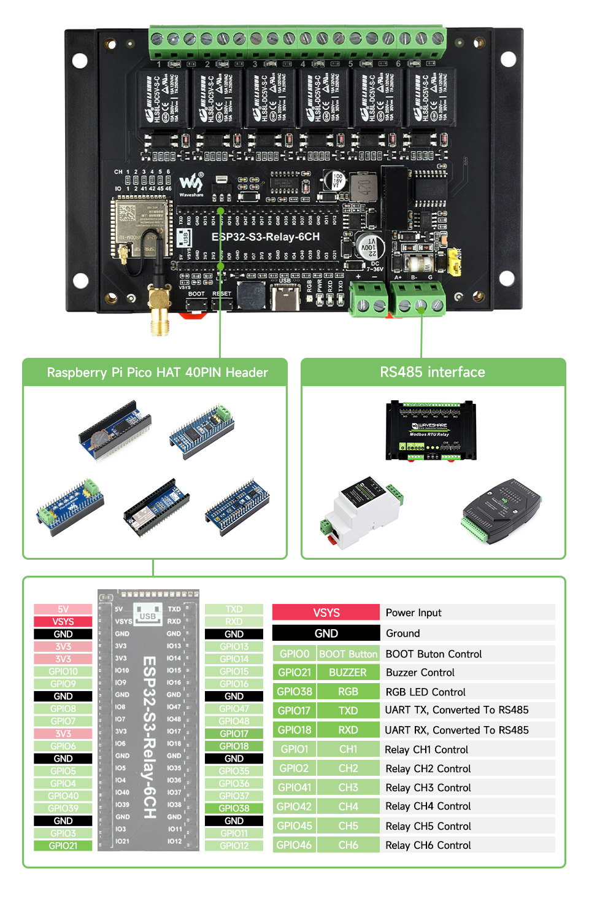

## Product description

This is a 6-relay board with an ESP32-S3 (N8).
It also has:-
Onboard isolated RS485,
Onboard 40PIN header compatible with some Raspberry Pi Pico HATs,
Built in buzzer,
RGB colorful LED,
Rail-mounted ABS case, easy to install, safe to use

Each relay has COM+NO+NC exposed. Rating ≤10A 250VAC/30VDC.
The board can be powered either via 7-36DC or via 5VDC (USB-C).
It can bought from: https://www.waveshare.com/esp32-s3-relay-6ch.htm

## GPIO Pinout



## Basic Config

```yaml
# based on https://github.com/ryansch/esphome-config/blob/main/waveshare-esp32-s3-relay-6ch.yaml

esphome:
  name: waveshare-6ch-relay

esp32:
  board: esp32-s3-devkitc-1
  flash_size: 8MB
  framework:
    type: arduino

# Enable logging
logger:
  level: DEBUG
# Enable Home Assistant API
api:
    password: !secret api_password

ota:
  - platform: esphome
    password: !secret ota_password
    id: zone_controller_ota

wifi:
  ssid: !secret wifi_ssid
  password: !secret wifi_password

captive_portal:

web_server:
  port: 80

time:
  - platform: homeassistant
    id: homeassistant_time

binary_sensor:
  - platform: status
    name: "Status"

  - platform: gpio
    name: "Boot Button"
    pin:
      number: 0
      ignore_strapping_warning: true
      mode:
        input: true
      inverted: true
    disabled_by_default: true
    on_press:
      then:
        - button.press: restart_button


switch:
  - platform: gpio
    pin: GPIO1
    id: relay1
    name: Relay 1
  - platform: gpio
    pin: GPIO2
    id: relay2
    name: Relay 2
  - platform: gpio
    pin: GPIO41
    id: relay3
    name: Relay 3
  - platform: gpio
    pin: GPIO42
    id: relay4
    name: Relay 4
  - platform: gpio
    pin:
      number: GPIO45
      ignore_strapping_warning: true
    id: relay5
    name: Relay 5
  - platform: gpio
    pin:
      number: GPIO46
      ignore_strapping_warning: true
    id: relay6
    name: Relay 6

uart:
  tx_pin: GPIO17
  rx_pin: GPIO18
  baud_rate: 9600
  id: modbus_uart

# buzzer
output:
  - platform: ledc
    pin: GPIO21
    id: buzzer

rtttl:
  output: buzzer
  id: rtttl_buzzer
  gain: 30%

light:
  - platform: neopixelbus
    type: RGB
    variant: 800KBPS
    pin: GPIO38
    num_leds: 1
    name: "RGB LED"
    id: rgb_led

button:
  - platform: restart
    name: "Restart"
    id: restart_button
    entity_category: config

  - platform: factory_reset
    name: "Factory Reset"
    id: reset
    entity_category: config

  - platform: safe_mode
    name: "Safe Mode"
    internal: false
    entity_category: config
```
