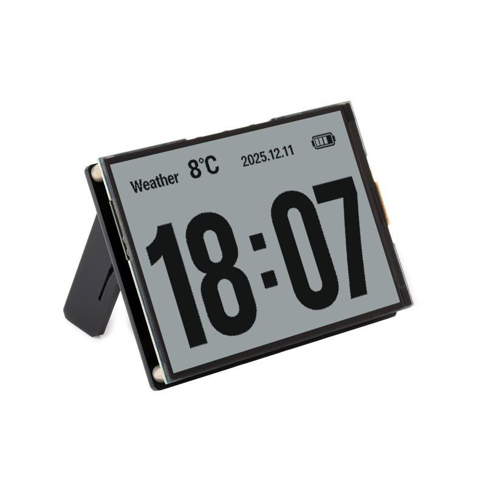

## Product Description

ESP32-S3 development board with a 4.2-inch reflective LCD (ST7305, 400x300 monochrome), 
dual microphone array (ES7210 ADC), speaker output (ES8311 DAC), SHTC3 temperature/humidity sensor, 
18650 battery holder with ADC monitoring, and two user buttons. 
The reflective LCD has no backlight and reads like e-paper in sunlight.

## Product Images



## GPIO Pinout

| GPIO   | Function                        |
|--------|----------------------------------|
| GPIO0  | BOOT button (active low)         |
| GPIO4  | Battery ADC                      |
| GPIO5  | Display DC                       |
| GPIO8  | I2S DOUT (speaker)               |
| GPIO9  | I2S BCLK                         |
| GPIO10 | I2S DIN (microphone)             |
| GPIO11 | SPI CLK (display)                |
| GPIO12 | SPI MOSI (display)               |
| GPIO13 | I2C SDA                          |
| GPIO14 | I2C SCL                          |
| GPIO16 | I2S MCLK                         |
| GPIO18 | KEY button (active low)          |
| GPIO40 | Display CS                       |
| GPIO41 | Display RESET                    |
| GPIO45 | I2S LRCLK                        |
| GPIO46 | Speaker amplifier enable         |

## Basic Configuration

```yaml
substitutions:
  name: "waveshare-esp32-s3-rlcd-42"
  friendly_name: "Waveshare ESP32-S3-RLCD-4.2"

esphome:
  name: "${name}"
  friendly_name: "${friendly_name}"

esp32:
  board: esp32-s3-devkitc-1
  framework:
    type: esp-idf

psram:
  mode: octal
  speed: 80MHz

logger:

wifi:
  ssid: !secret wifi_ssid
  password: !secret wifi_password

external_components:
  - source: github://kylehase/ESPHome-ST7305-RLCD
    components: [st7305_rlcd]
```

## I2C Bus

Shared by SHTC3 sensor, ES8311 DAC, and ES7210 ADC.

```yaml
i2c:
  sda: GPIO13
  scl: GPIO14
  scan: true
  id: bus_a
```

## Display — ST7305 RLCD

Reflective LCD, 400x300 monochrome. Uses SPI.

```yaml
spi:
  clk_pin: GPIO11
  mosi_pin: GPIO12

display:
  - platform: st7305_rlcd
    model: WAVESHARE_400X300
    id: my_display
    width: 400
    height: 300
    cs_pin: GPIO40
    dc_pin: GPIO5
    reset_pin: GPIO41
    data_rate: 1MHz
    update_interval: 1min
    show_test_card: true
```

## Audio — I2S, ES8311 DAC, ES7210 ADC

Single shared I2S bus for speaker output and dual microphone input.

```yaml
i2s_audio:
  - id: i2s_shared
    i2s_lrclk_pin: GPIO45
    i2s_bclk_pin: GPIO9
    i2s_mclk_pin: GPIO16

audio_dac:
  - platform: es8311
    id: es8311_dac
    bits_per_sample: 16bit
    sample_rate: 16000

audio_adc:
  - platform: es7210
    id: es7210_adc
    bits_per_sample: 16bit
    sample_rate: 16000
    mic_gain: 24dB

speaker:
  - platform: i2s_audio
    id: i2s_audio_speaker
    i2s_audio_id: i2s_shared
    i2s_dout_pin: GPIO8
    dac_type: external
    audio_dac: es8311_dac
    channel: left
    sample_rate: 16000
    bits_per_sample: 16bit
    buffer_duration: 100ms
    timeout: never

microphone:
  - platform: i2s_audio
    id: va_mic
    i2s_audio_id: i2s_shared
    i2s_din_pin: GPIO10
    adc_type: external
    sample_rate: 16000
    bits_per_sample: 16bit
    pdm: false

switch:
  - platform: gpio
    name: "Speaker Enable"
    pin: GPIO46
    restore_mode: RESTORE_DEFAULT_ON
```

## Sensors

### Battery Monitoring

Battery voltage is read via ADC on GPIO4 with a 3x voltage divider. 
The 18650 cell ranges from 2.5V (empty) to 4.2V (full).

```yaml
sensor:
  - platform: adc
    id: bat_voltage
    name: "Battery Voltage"
    pin: GPIO4
    attenuation: 12db
    update_interval: 60s
    filters:
      - multiply: 3.0

  - platform: copy
    source_id: bat_voltage
    id: bat_level
    name: "Battery Level"
    unit_of_measurement: "%"
    filters:
      - calibrate_linear:
          - 2.5 -> 0.0
          - 4.2 -> 100.0
      - clamp:
          min_value: 0
          max_value: 100
```

### SHTC3 Temperature and Humidity

```yaml
  - platform: shtcx
    temperature:
      name: "Temperature"
    humidity:
      name: "Humidity"
    address: 0x70
    update_interval: 60s
    i2c_id: bus_a
```

## Buttons

Two user-accessible buttons, active low.

```yaml
binary_sensor:
  - platform: gpio
    name: "Boot Button"
    pin:
      number: GPIO0
      inverted: true
      mode: INPUT

  - platform: gpio
    name: "Key Button"
    pin:
      number: GPIO18
      inverted: true
      mode: INPUT
```

## Voice Assistant Configuration

This extends the basic configuration above to add a full voice assistant pipeline 
with on-device wake word detection, 
push-to-talk, mute toggle, and media playback. 
Requires a Home Assistant instance with a Voice Assistant pipeline configured.

```yaml
api:

ota:
  - platform: esphome

esp32:
  board: esp32-s3-devkitc-1
  framework:
    type: esp-idf
    components:
      - espressif/esp-nn==1.1.2

speaker:
  - platform: i2s_audio
    id: i2s_audio_speaker
    i2s_audio_id: i2s_shared
    i2s_dout_pin: GPIO8
    dac_type: external
    audio_dac: es8311_dac
    channel: left
    sample_rate: 16000
    bits_per_sample: 16bit
    buffer_duration: 100ms
    timeout: never

  - platform: resampler
    id: announcement_speaker
    output_speaker: i2s_audio_speaker

media_player:
  - platform: speaker
    id: speaker_media_player
    name: None
    announcement_pipeline:
      speaker: announcement_speaker
      format: FLAC
      sample_rate: 16000
      num_channels: 1
    files:
      - id: wake_word_triggered_sound
        file: https://github.com/esphome/home-assistant-voice-pe/raw/dev/sounds/wake_word_triggered.flac

micro_wake_word:
  id: mww
  microphone:
    microphone: va_mic
    channels: 0
    gain_factor: 4
  vad:
  models:
    - model: hey_jarvis
  on_wake_word_detected:
    - media_player.speaker.play_on_device_media_file:
        media_file: wake_word_triggered_sound
        announcement: true
    - delay: 300ms
    - voice_assistant.start:
        wake_word: !lambda return wake_word;

voice_assistant:
  id: va
  microphone:
    microphone: va_mic
    channels: 0
    gain_factor: 4
  media_player: speaker_media_player
  micro_wake_word: mww
  use_wake_word: false
  noise_suppression_level: 2
  auto_gain: 31dBFS
  on_error:
    - script.execute: restart_mww
  on_end:
    - script.execute: restart_mww
  on_client_connected:
    - micro_wake_word.start:
  on_client_disconnected:
    - micro_wake_word.stop:

script:
  - id: restart_mww
    then:
      - delay: 500ms
      - wait_until:
          not:
            media_player.is_announcing:
      - wait_until:
          not:
            speaker.is_playing:
              id: i2s_audio_speaker
      - delay: 200ms
      - micro_wake_word.start:

switch:
  - platform: gpio
    name: "Speaker Enable"
    pin: GPIO46
    restore_mode: RESTORE_DEFAULT_ON

  - platform: template
    name: "Mute"
    id: mute_switch
    icon: mdi:microphone-off
    optimistic: true
    restore_mode: RESTORE_DEFAULT_OFF
    on_turn_on:
      - micro_wake_word.stop:
      - voice_assistant.stop:
    on_turn_off:
      - if:
          condition:
            switch.is_on: use_wake_word_switch
          then:
            - micro_wake_word.start:

  - platform: template
    name: "Use Wake Word"
    id: use_wake_word_switch
    icon: mdi:chat-processing
    optimistic: true
    restore_mode: RESTORE_DEFAULT_ON
    on_turn_on:
      - if:
          condition:
            not:
              switch.is_on: mute_switch
          then:
            - micro_wake_word.start:
    on_turn_off:
      - micro_wake_word.stop:

binary_sensor:
  - platform: gpio
    name: "Boot Button"
    pin:
      number: GPIO0
      inverted: true
      mode: INPUT
    on_press:
      - voice_assistant.start:
    on_release:
      - voice_assistant.stop:

  - platform: gpio
    name: "Key Button"
    pin:
      number: GPIO18
      inverted: true
      mode: INPUT
    on_press:
      - switch.toggle: mute_switch

number:
  - platform: template
    name: "TTS Volume"
    id: tts_volume
    icon: mdi:volume-high
    min_value: 0
    max_value: 100
    step: 5
    initial_value: 75
    optimistic: true
    restore_value: true
    set_action:
      then:
        - media_player.volume_set:
            id: speaker_media_player
            volume: !lambda "return x / 100.0;"
```

## Notes

- The display uses an external ESPHome component: [kylehase/ESPHome-ST7305-RLCD](https://github.com/kylehase/ESPHome-ST7305-RLCD)
- PSRAM (8MB octal) is required for display rendering and audio buffers
- The speaker amplifier must be enabled via GPIO46 for audio output
- The board also has a PCF85063A RTC and a microSD slot, which are not yet supported in this config
- The board has two 8-pin expansion headers (2.54mm pitch)
