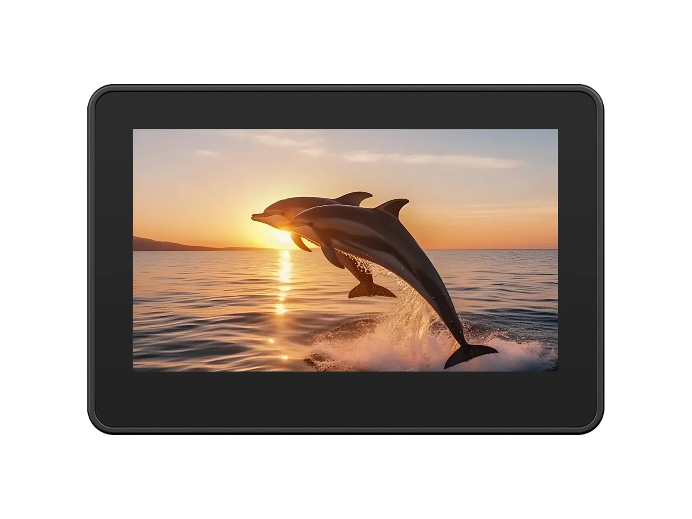

## Waveshare ESP32-S3-Touch-LCD-4.3C


A small self-contained  4.3" widescreen display available in a plastic case.  Basic video/audio/microphone capabilites.

The user can elect to install an internal battery.  

The LEDs on the side of the hardware are indicators for the battery and cannot be controlled via ESPhome.  

The on/off switch cuts power to the battery, otherwise has no affect if unit is hardwired.

Reset button restarts the device.  The boot button is useful during initial installation of ESPhome.  

## Hardware Specifications

| Feature      | Spec                    |
| ------------ | ----------------------- |
| CPU          | ESP32-S3-WROOM-1-N16R8 |
| Flash        | 16MB                    |
| PSRAM        | 8MB                     |
| Screen       | 800\*480 RGB LCD |
| Touch        | GT911                  |
| Audio        | ES8311 |
| Microphone | ES7210 |
| Time |  PCF85063 |
| Storage | TF Card Slot |
| IO Expander | CH32V003 |

## Installation

Hold the reset button while connecting the USB-C cable.  Then install ESPhome via standard browser method.

## Basic Configuration

The following implements all hardware except the TF card slot and was built on esphome 2026.5.1.

The CH32V003 IO expander requests an external component found .

In this config, the display will turn off after 60s idle.  If display is off, touch will turn the display back on.  

Some optimizations in esphome and esp32 compoments are set to increase the FPS performance.

```yaml file=config.yaml
```
