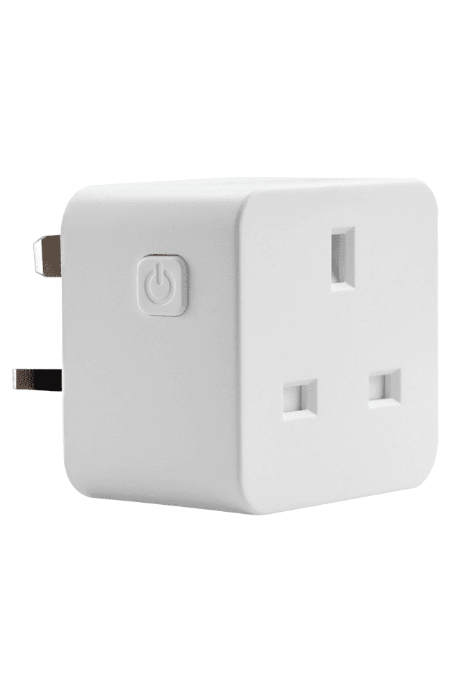

## Product Images



## GPIO Pinout

| Pin    | Function             |
| ------ | -------------------- |
| GPIO04 | LED 1  |
| GPIO05 | Relay 1          |
| GPIO13 | Button 1  |

```yaml
substitutions:
  device_name: wooxr4785
  friendly_name: wooxr4785

esphome:
  name: "${device_name}"
  platform: ESP8266
  board: esp01_1m

logger:

api:

web_server:
  port: 80

binary_sensor:
  - platform: gpio
    pin:
      number: GPIO13
      mode: INPUT_PULLUP
      inverted: True
    name: "${friendly_name} Button"
    id: "${device_name}_button"
    on_multi_click:
      - timing:
          - ON for at most 1s
          - OFF for at least 0.2s
        then:
          - switch.toggle: "${device_name}_relay"
      - timing:
          - ON for at least 4s
        then:
          - button.press: restart_button    

button:
  - platform: restart
    name: ${friendly_name} Restart
    id: restart_button

switch:
  - platform: gpio
    name: "${friendly_name}"
    id: "${device_name}_relay"
    pin: GPIO05

output:
  - platform: gpio
    pin: GPIO04
    inverted: true
    id: led

sensor:
  - <<: !include includes/sensors/uptime.yaml
  - <<: !include includes/sensors/wifi_signal.yaml

text_sensor:
  - <<: !include includes/text_sensor/version.yaml
  - <<: !include includes/text_sensor/wifi_info.yaml

<<: !include includes/default.yaml

