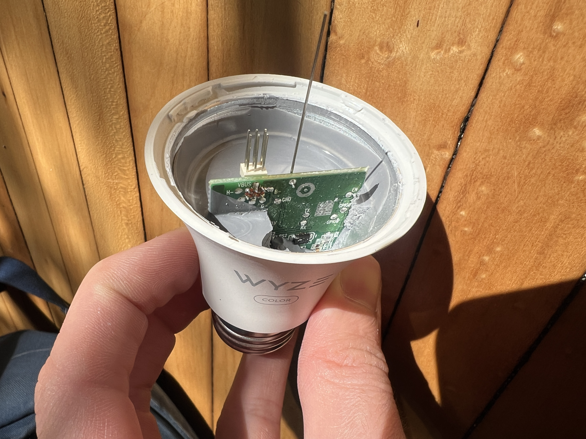
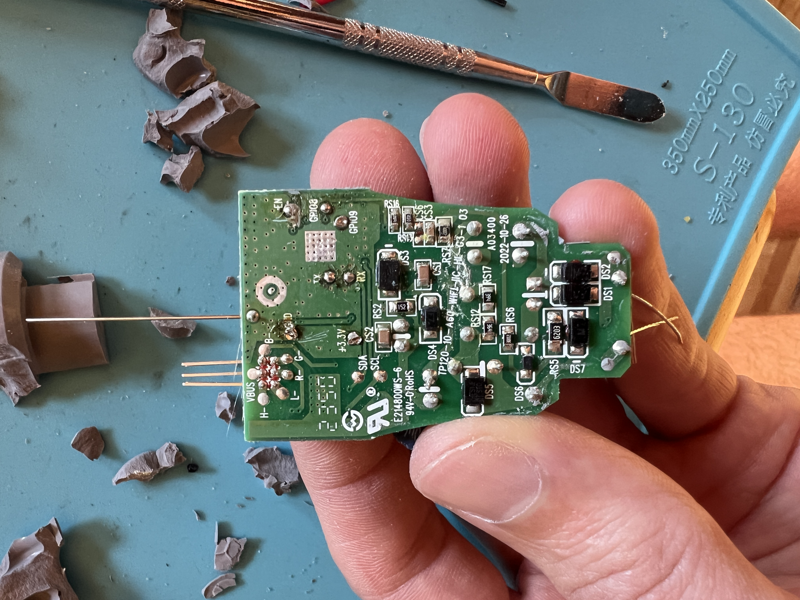

## Gernal Notes

Wyze updated their original wyze bulb color which makes it slightly easier to flash esphome. The V2 features an esp32-c3 that controls a BP5758 LED driver. [Product Page](https://www.wyze.com/products/wyze-bulb-color)

## Materials

- usb-uart adapter for flashing
- wire (I use gpio jumper wires)
- soldering iron and solder
- flat blade or metal spudger

## Instructions

1. Remove the plastic globe. This is held in with adhesive and can be removed with a flat blade or metal spudger
2. Remove the LED array. This is also only held in with adhesive so just pry it up by one of the sides. Be careful not to damage the 6 metal pins and the antenna that go through the led array plate.
3. Remove the potting. The potting only needs to be removed on the side opposite of the 6 led pins. Be careful not to damage any components on the board while removing.



4. Solder to pads on the bulb. The tight space can make this tricky but it's very doable. Make sure you aren't shorting anything.



5. Connect your wires to your usb-uart adapter and flash. See connection chart below.
6. Reassemble the bulb in reverse

### Flashing Connections

| Bulb  | USB-uart |
| ----- | -------- |
| 3.3v  | 3.3v     |
| GND   | GND      |
| EN    | 3.3v     |
| GPIO8 | 3.3v     |
| GPIO9 | GND      |
| TX    | RX       |
| RX    | TX       |

## GPIO Pinout

| Pin    | Function |
| ------ | -------- |
| GPIO18 | SDC      |
| GPIO19 | SDA      |

## Basic Configuration

```yaml
substitutions:
  deviceid: smart_bulb_1
  esphomename: smart-bulb-1
  devicename: Smart Light

esp32:
  variant: esp32c3
  framework:
    type: esp-idf
    version: recommended

esphome:
  name: $esphomename

wifi:s
  ssid: !secret wifi_ssid
  password: !secret wifi_password
  power_save_mode: NONE

  ap:
    ssid: $deviceid

captive_portal:

api:

ota:
  - platform: esphome

web_server:
  port: 80

logger:
  baud_rate: 0
  # level: DEBUG

bp5758d:
  data_pin: GPIO19
  clock_pin: GPIO18

# Define output pins
output:
  - platform: bp5758d
    id: output_red
    channel: 3
    current: 35
  - platform: bp5758d
    id: output_green
    channel: 2
    current: 35
  - platform: bp5758d
    id: output_blue
    channel: 1
    current: 35
  - platform: bp5758d
    id: output_white
    channel: 4
    current: 35

# Define a light entity
light:
  - platform: rgbw
    name: ${devicename}
    id: ${deviceid}
    red: output_red
    green: output_green
    blue: output_blue
    white: output_white
```
