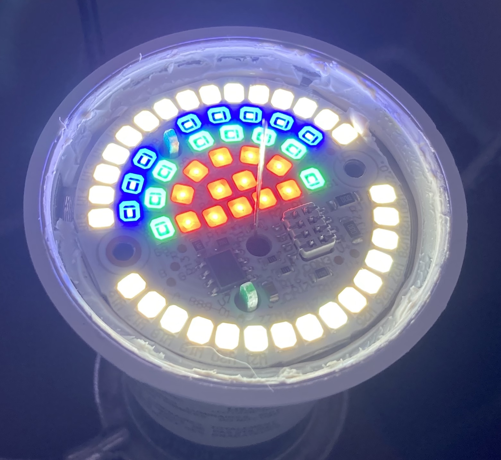
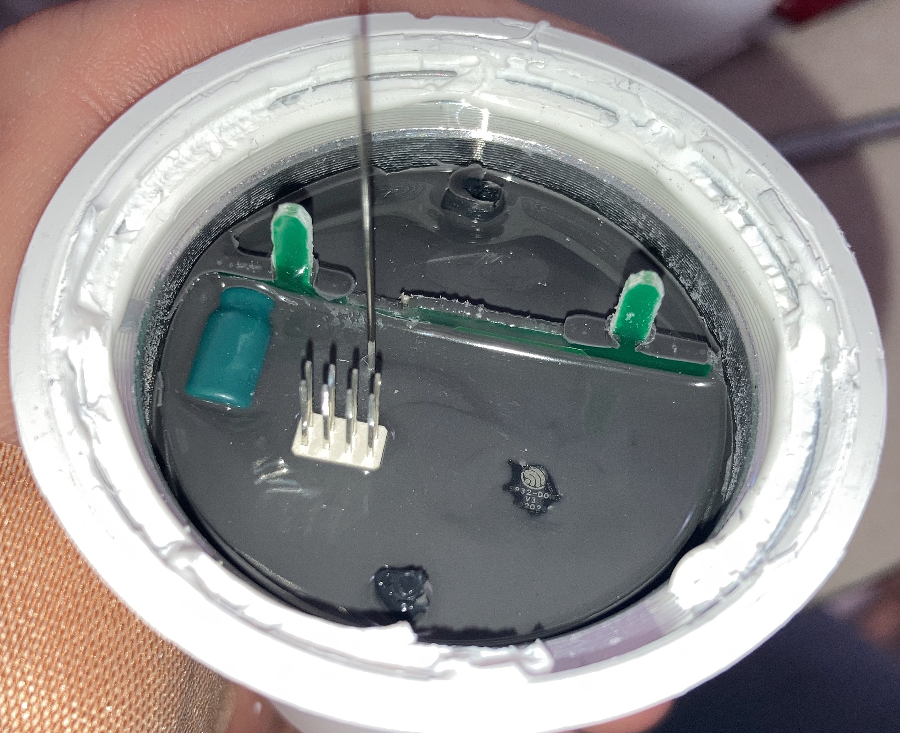
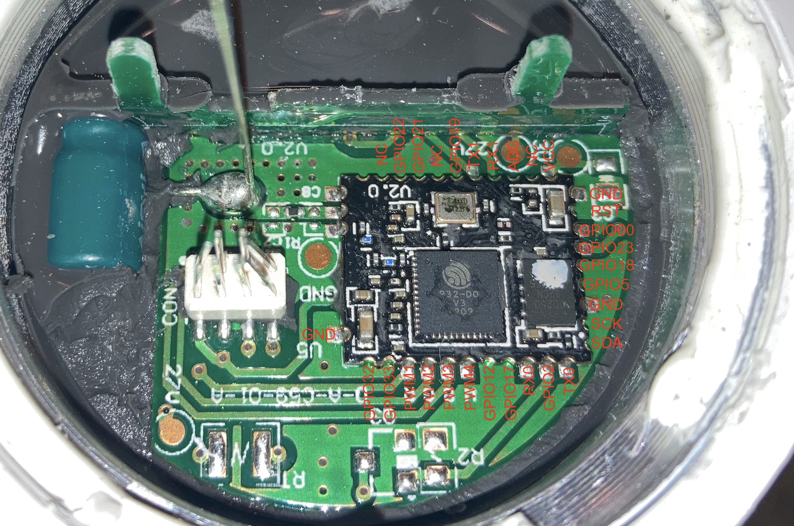
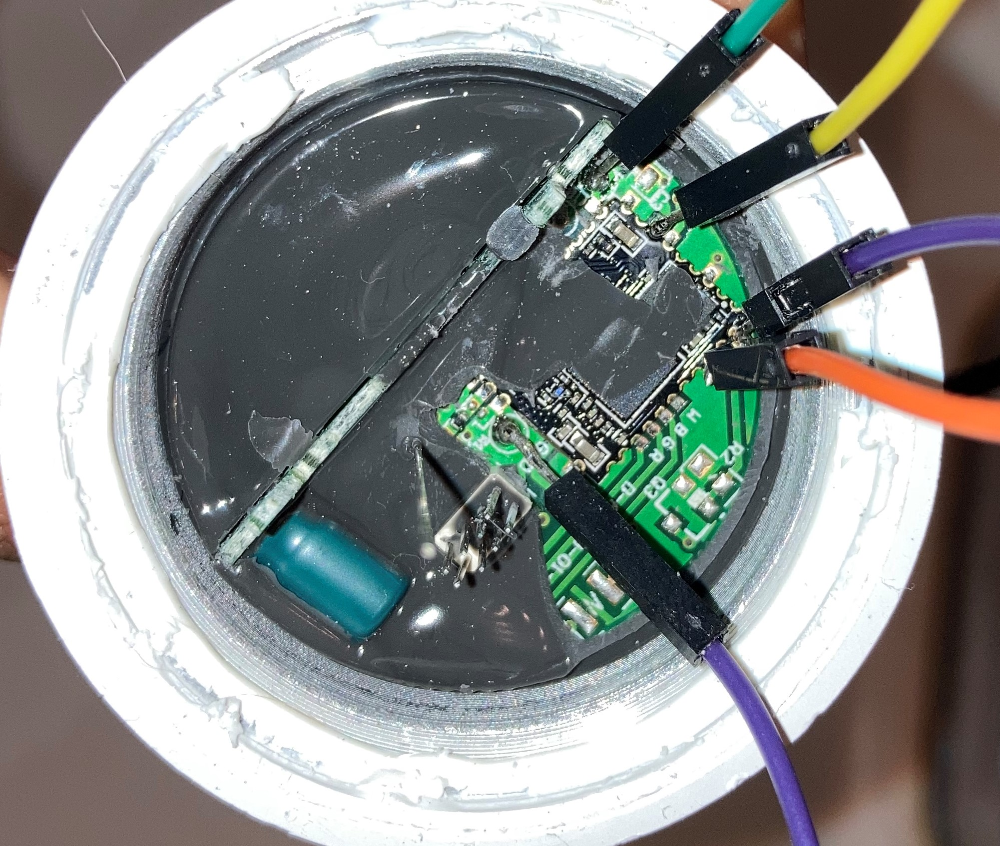

## Gernal Notes

This is for the original Wyze Bulb Color, Check out the V2 if you're buying new bulbs

## Materials

- usb-uart adapter for flashing
- wire (I use gpio jumper wires)
- soldering iron and solder
- flat blade or metal spudger
- philips head screwdriver

## Instructions

1. Remove the plastic globe. This is held in with adhesive and can be removed with a flat blade or metal spudger
2. Remove the LED array. This held on with two philips head screws

   

3. Remove the metal plate. This is going to be a challenge. I used a needle nose plyers to grab under the hole in the middle of the plate and slowly wiggle it out. The plate will most likely get bent up but you can easily bend it back into shape for reinstallation.
4. Remove the potting. The potting only needs to be removed above the esp32 chip (and surrounding area). See picture for reference

   

5. Solder to pads on the bulb. You can also use the ground pin thats part of the 8 pins that go to the led array

   
   

6. Connect your wires to your usb-uart adapter and flash. See connection chart below.
7. Reassemble the bulb in reverse

### Flashing Connections

| Bulb  | USB-UART |
| ----- | -------- |
| 3.3v  | 3.3v     |
| GND   | GND      |
| GPIO0 | GND      |
| TX    | RX       |
| RX    | TX       |

## GPIO Pinout

| Pin    | Function     |
| ------ | ------------ |
| GPIO13 | PWM BLUE     |
| GPIO14 | PWM RED      |
| GPIO15 | PWM WHITE    |
| GPIO23 | POWER SUPPLY |
| GPIO26 | PWM GREEN    |

## Basic Configuration

```yaml
substitutions:
  deviceid: smart_bulb
  esphomename: smart-bulb # underscore in hostname is discouraged
  devicename: Smart Bulb

esp32:
  board: esp32doit-devkit-v1
  framework:
    type: esp-idf
    version: recommended

esphome:
  name: $esphomename

wifi:
  ssid: !secret wifi_smart_ssid
  password: !secret wifi_password

  ap:
    ssid: $deviceid

captive_portal:

api:

ota:
  - platform: esphome

web_server:
  port: 80

logger:
  baud_rate: 0
  # level: DEBUG

# Define output pins
output:
  - platform: ledc
    id: output_red
    pin: GPIO14
    max_power: 0.90
    power_supply: rgb_power
    frequency: 1220hz
  - platform: ledc
    id: output_green
    pin: GPIO26
    max_power: 0.90
    power_supply: rgb_power
    frequency: 1220hz
  - platform: ledc
    id: output_blue
    pin: GPIO13
    max_power: 0.90
    power_supply: rgb_power
    frequency: 1220hz
  - platform: ledc
    id: output_white
    pin: GPIO15
    max_power: 0.80
    frequency: 1220hz

power_supply:
  - id: rgb_power
    pin: GPIO23
    enable_time: 0ms

# Define a light entity
light:
  - platform: rgbw
    name: ${devicename}
    id: ${deviceid}
    red: output_red
    green: output_green
    blue: output_blue
    white: output_white
```
